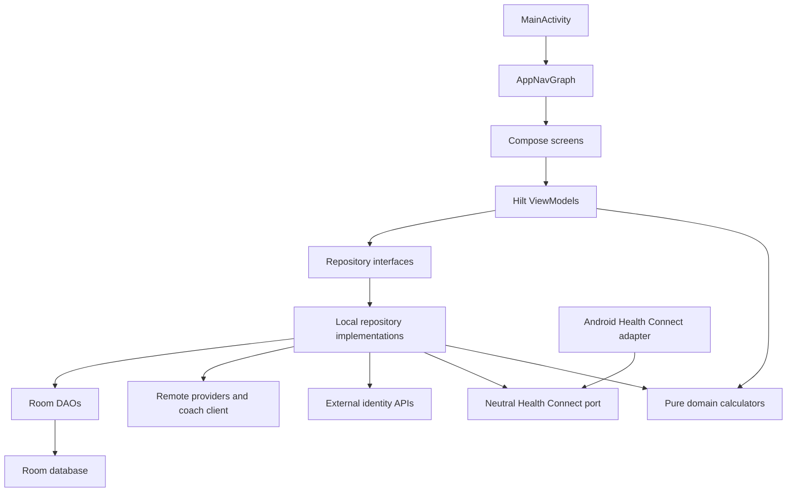

# MusFit App Architecture

This is the living map of the current MusFit Android architecture. Stable facts
such as routes, schema continuity, and workflow paths are checked against source
by `scripts/dev/test-dev-workflow.ps1`. The dated full-app audit below records a
deeper snapshot and the remediation backlog derived from it.

Related documents:

- [Active architecture remediation slice plan - 2026-07-16](architecture-remediation-slice-plan-2026-07-16.md)
- [Full app architecture audit — 2026-07-10](app-architecture-audit-2026-07-10.md)
- [Architecture remediation backlog — 2026-07-10](architecture-remediation-backlog-2026-07-10.md)
- [Screen contracts](screen-contracts.md)
- [Data models](data-models.md)

<!-- source-derived-facts:start -->
## Source-derived facts

- The top-level destination names and routes in the table below are checked against `AppDestination`.
- The Room version, newest exported schema, contiguous migrations, and documented table inventory are checked against source and schema JSON.
- The adaptive root-navigation component name is derived from `AppNavGraph` and checked here.
- The workflow and architecture-boundary checks run from `scripts/dev/test-dev-workflow.ps1` and `ArchitectureBoundaryTest`.
<!-- source-derived-facts:end -->

## Product Shape

MusFit is an Android-only, local-first fitness and nutrition tracker. The app is inspired by the information architecture of food trackers and training loggers, but uses original UI and app-specific models.

Top-level navigation keeps the same four destinations while adapting its chrome
to the available width: a bottom bar below 600 dp, a navigation rail from 600
through 839 dp, and a permanent navigation drawer at 840 dp and above. The
saveable Navigation 3 back stack remains outside that layout choice, so a live
resize does not recreate destinations or their collector owners. Scanner routes
hide root chrome and draw edge to edge.

| Destination | Route | Purpose |
| --- | --- | --- |
| Today | `today` | Configurable metric carousel, readiness, dashboard editor, deterministic coach feed, and feature shortcuts. |
| Food | `food` | Food diary, add food flow, saved foods, barcode lookup, nutrition goals, water, templates, recipes, shopping list, and Food Health Connect sync UI/boundary. |
| Training | `training` | Routines, exercise library, active workouts, rest timer, supersets, PR/plate hints, workout history/recaps, progress, and quick set logging. |
| Profile | `profile` | Body/progress hub, account identity, goals, coach configuration, app settings, and Health Connect controls. |

The MVP is local-first. It has local account/session identity plus optional
Google/GitHub identity sign-in, but no cloud sync, analytics, subscription
layer, social features, or wearable cloud API integration. Full per-account data
isolation is not implemented yet; see the architecture audit.

## Platform

| Area | Implementation |
| --- | --- |
| Language | Kotlin |
| UI | Jetpack Compose with Material 3 |
| Navigation | Navigation Compose, single activity |
| State | Hilt ViewModels exposing immutable `StateFlow` UI state |
| Storage | Room local database with exported, migration-only schemas |
| Async | Kotlin coroutines and Flow |
| DI | Hilt |
| Food remote data | Retrofit and Moshi client for Open Food Facts |
| Account identity | AndroidX Credential Manager for Google and GitHub device flow via Retrofit; OAuth client IDs are supplied through Gradle properties or environment variables. |
| Image loading | Coil Compose |
| Barcode and label scan | CameraX plus ML Kit barcode/text recognition |
| Health data | Android Health Connect boundary |
| Min/target SDK | minSdk 28, targetSdk 37 |
| Application ids | production `com.musfit`; side-by-side internal `com.musfit.internal` |

## Source Layout

| Path | Responsibility |
| --- | --- |
| `app/src/main/java/com/musfit/MainActivity.kt` | Single Android entry activity. Applies `MusFitTheme` and hosts `AppNavGraph`. |
| `app/src/main/java/com/musfit/MusFitApplication.kt` | Hilt application entrypoint. |
| `app/src/main/java/com/musfit/ui/` | App-shell composition, global navigation, feature entry adapters, and app-owned integration rationale UI. |
| `feature/food/src/main/java/com/musfit/ui/food/` | Food presentation, its retained nested navigator, UI state, ViewModel, and scanner entry wiring. |
| `feature/training/src/main/java/com/musfit/ui/training/` | Training presentation, its retained nested navigator, UI state, and ViewModels. |
| `feature/profile/src/main/java/com/musfit/ui/profile/` | Profile presentation, settings surfaces, UI state, ViewModels, and app-supplied entry configuration contract. |
| `feature/today/src/main/java/com/musfit/ui/today/` | Today dashboard and coach presentation, UI state, ViewModels, callback navigation, and app-supplied LAN-policy contract. |
| `core/model/src/main/kotlin/com/musfit/domain/` | Android-free domain models, calculators, and inward-facing ports. |
| `core/database/src/main/java/com/musfit/data/local/` | Room database, migrations, DAOs, entities, and query projection rows. |
| `core/network/src/main/java/com/musfit/data/remote/` | Flavor-aware Open Food Facts, GitHub identity, and coach transport adapters. |
| `core/data/src/main/java/com/musfit/data/repository/` | Feature repository contracts, local implementations, and repository data models. |
| `core/designsystem/src/main/java/com/musfit/ui/` | Reusable Compose components plus Material 3 theme and MusFit semantic tokens. |
| `core/testing/src/main/kotlin/com/musfit/core/testing/` | Shared JVM test fixtures, including the main-dispatcher rule. |
| `integration/healthconnect/src/main/java/com/musfit/integrations/healthconnect/` | Android Health Connect adapter, platform-record mapping, and permission inventory; depends only on the neutral `:core:model` port. |
| `integration/scanner/src/main/java/com/musfit/integrations/scanner/` | CameraX lifecycle ownership plus ML Kit barcode/OCR adapters with typed scan results and no Food UI state. |
| `app/src/main/java/com/musfit/integrations/healthconnect/` | App-owned Health permission-rationale presentation. |
| `app/src/test/java/com/musfit/` | App-shell, transfer, cross-feature contract, and architecture tests; feature, shared, and integration modules own their corresponding unit and UI regression tests. |
| `app/src/internal/` | Internal-only LAN manifest/resource surface and developer identity overrides. |
| `app/src/androidTest/java/com/musfit/` | Device/instrumentation tests, including the non-distributed internal seed boundary. |
| `app/schemas/com.musfit.data.local.MusFitDatabase/` | Contiguous exported Room schema JSON files through the version declared in `MusFitDatabase.kt`. |

The app shell depends on `:feature:food`, `:feature:training`, `:feature:profile`,
and `:feature:today` through their public entrypoints and callback/action contracts. Feature modules do
not depend on `:app` or on one another. The root `verifyModuleGraph` task
enforces those edges. Convention
plugins in `build-logic` own the common Kotlin, Android library, Compose, and
test configuration; `verifyCoreModules` tests those plugins, the graph rules,
and all shared, integration, and feature modules.

## Layering

Dependencies flow inward from UI to repository contracts and neutral domain
ports, with transport, Room, Health Connect, CameraX, and ML Kit types confined to their
adapters. `ArchitectureBoundaryTest` rejects feature-to-feature UI imports,
UI-to-remote imports, integration-to-Room imports, and data-to-concrete-adapter
imports.



## App Bootstrap And Navigation

`MusFitApplication` is annotated with `@HiltAndroidApp`. `MainActivity` is
annotated with `@AndroidEntryPoint`, enables edge-to-edge with theme-aware
system bars, and calls:

```kotlin
setContent {
    MusFitTheme {
        AppNavGraph()
    }
}
```

`AppNavGraph` owns a saveable Navigation 3 back stack and `NavDisplay`. Its
stable adaptive shell renders `MusFitBottomNav` on compact windows, a navigation
rail on medium windows, and a permanent navigation drawer on wide windows. It
defines the top-level routes:

- `today`
- `food`
- `training`
- `profile`

Profile also owns typed keys for settings, training progress, and nutrition
trends. Food owns nested typed scanner keys for:

- `barcode-scanner`
- `nutrition-label-scanner`

The app shell exposes the global coach action through the compact floating
action and through a Coach item in rail/drawer layouts. It mounts
`ChatPreviewSheet` above the current destination.

Barcode and nutrition-label scanner routes return saveable string results to
their retained Food navigator. Food forwards each result into `FoodViewModel`
and consumes it exactly once. While either camera route is active, Food asks the
app shell to remove root navigation chrome so the scanner can own the full
edge-to-edge surface.

Experimental adaptive candidates remain documentation-only. The current status
and mandatory adoption gates for MediaQuery, non-lazy Grid, and FlexBox live in
[experimental-adaptive-api-watchlist.md](experimental-adaptive-api-watchlist.md).

## Dependency Injection

Hilt modules live under `core/di`.

| Module | Responsibility |
| --- | --- |
| `DatabaseModule` | Builds `MusFitDatabase`, registers all migrations, and provides DAOs. |
| `RepositoryModule` | Binds account/auth, AI coach/chat, coach feed, Food, Training, Health, Profile, Goals, secret-store, and exercise-dataset boundaries. |
| `NetworkModule` | Provides Moshi, OkHttp, auth config, Open Food Facts and GitHub Retrofit APIs, and binds the Food product and coach-completion clients. |
| `AiCoachConfigModule` | Provides optional internal-only local-agent defaults from local configuration. |
| `HealthModule` | Binds `HealthConnectGateway` to `HealthConnectManager`. |

Repositories are injected into ViewModels. DAOs, remote providers, and gateways are injected into repository implementations.

## State Management

Feature screens generally expose immutable observable state from a
`@HiltViewModel`. Some ViewModels wrap a private `MutableStateFlow`; others
combine repository flows and materialize them with `stateIn`. Compose collects
that state, user events call ViewModel methods, and repositories expose Flow
reads plus suspend/write APIs.

Food and Today use date-scoped Flow collection. Food owns a `selectedDateFlow` and switches diary, plan, and water streams with `flatMapLatest`.

## Persistence

The database is `MusFitDatabase` with `exportSchema = true`. Derive its current
version from `core/database/src/main/java/com/musfit/data/local/MusFitDatabase.kt`; the
newest committed schema file must match it.

Major table groups:

- Account: local account identity, active account session, provider metadata, and optional Google/GitHub remote identity key.
- Food: foods, servings, meals, meal items, barcode products, goals, quick presets, meal definitions, templates, recipes, shopping list, water entries, food Health Connect sync state.
- Training: exercises, routines, routine exercises, workout sessions, workout sets with set type, RPE, notes, completion state, optional superset grouping, and local tool settings.
- Health: body metrics, daily health summaries, Health Connect sync state, and account-owned export identity/version/provider records.
- Profile/Today: profile and app settings, user goals, coach-feed messages, and dashboard pin order.
- AI coach: provider settings plus account/provider-scoped chat threads and messages; runtime-entered secrets are stored outside Room.

Room migrations are registered from version 1 through the current version in
`DatabaseModule`. The app does not use destructive migration fallback, so schema
changes must include a registered migration and a committed schema JSON.

Saved Food reads use one account-scoped foods-plus-servings projection rather
than a per-food serving query. Production database open installs the measured
case-insensitive Food name/brand/order index after Room schema validation; the
exact query-count, P90, storage, and write-fanout evidence lives in
`FoodPerformanceMigration40To41Test` and [data-models.md](data-models.md).

### Training Persistence Notes

Training stores only local strength-training data. Exercise rows hold list metadata plus detail fields (`primaryMuscles`, `secondaryMuscles`, `instructions`, and `localNotes`). Routines store starter/custom status, optional `programName`, and CSV-backed tags, with ordered routine exercises in `routine_exercises`. Active and completed workouts use the same session/set tables, with session `status` separating active, completed, and discarded workouts. Completed workout recap data is derived from the session and completed set rows, including local session notes. Supersets are represented by a nullable `supersetGroupId` on workout sets and are derived into grouped UI models by the repository. Global Training tool settings live in `training_settings` for default rest duration, bar weight, and available plate inventory.

Active-workout prior-set labels and PR baselines are loaded in one batched query
for all displayed exercise IDs. The latest indexed schema migration replaces the redundant two-column
history index with the measured account/exercise/completion/session/order index,
and production database open installs the collation-aware exercise-name index
after Room schema validation. Executable query-count, query-plan, P90, and
storage evidence lives in `TrainingPerformanceMigration41To42Test` and
[data-models.md](data-models.md).

## Remote And Device Integrations

### Account Identity

The account system is local-first. `AccountRepository` owns local account rows and the active-account pointer. Google and GitHub sign-in only link an external identity to the local account row; access tokens are not persisted and cloud sync is not implemented.

- Google sign-in uses AndroidX Credential Manager with `GetSignInWithGoogleOption`. Set `MUSFIT_GOOGLE_WEB_CLIENT_ID` as a Gradle property or environment variable to enable the button.
- GitHub sign-in uses the OAuth device flow and `read:user user:email` scope. Set `MUSFIT_GITHUB_OAUTH_CLIENT_ID` as a Gradle property or environment variable to enable the button.
- Provider identities are stored in `accounts.remoteUserId` as provider-scoped keys such as `google:<id>` or `github:<id>`, with `authProvider` used for display/state.

### Open Food Facts

Food product lookup is hidden behind `FoodProductProvider`.

- `lookupBarcode(barcode)` returns `ProductLookupResult.Found`, `NotFound`, or `Failed`.
- `searchProducts(query, pageSize)` returns `ProductSearchResult.Success` or `Failed`.
- The Retrofit API calls `https://world.openfoodfacts.org/api/v2/product/{barcode}.json` and `https://search.openfoodfacts.org/search`.

### AI Coach

The global coach uses `AiCoachRepository` for configured provider/agent metadata,
`AiCoachChatRepository` for local thread history and orchestration, and
`CoachCompletionClient` for the configured OpenAI-compatible or local-agent
endpoint. Runtime-entered keys use the local `AiCoachSecretStore`. The optional
internal configuration contains only nonsecret endpoint/model defaults. No
variant has an API-key BuildConfig field or fallback; a connection uses only an
account-keyed credential resolved from the Android-Keystore-backed runtime
store.

### Camera And ML Kit

`BarcodeScannerScreen` uses CameraX preview and ML Kit barcode recognition for EAN/UPC formats. `NutritionLabelScannerScreen` uses CameraX preview and ML Kit text recognition, returning raw OCR text to Food. The Food domain parser then performs best-effort macro extraction and still requires user review before save.

### Health Connect

Health Connect is behind the Android-free `domain/health/HealthConnectGateway`
port. `HealthConnectManager` is the Android adapter in
`:integration:healthconnect`; repositories map Room rows to neutral workout/food
snapshots before dispatch.

The app currently supports:

- Status and permission availability checks.
- Reading recent steps, calories, distance, sleep, exercise sessions, weight, body fat, and resting heart rate.
- Exporting completed workouts.
- Food and hydration export boundary through `HealthConnectFoodExportPayload`.
- Stable client identities derived from record type plus immutable account/entity IDs, with monotonic versions and persisted provider IDs.
- Typed daily-read outcomes that distinguish complete, partial, legitimately empty, unavailable/revoked, and failed reads; coroutine cancellation is always rethrown.
- Calendar-day range imports batch provider work by metric, preserve zone-aware day boundaries, and consume every continuation token for raw record reads.

The Food sync card handles availability, permission summary, enable/disable
state, last sync, and sync errors. Export retries consult
`health_connect_export_records`, so unchanged records do not issue another
provider write; changed records keep their client ID and advance their version.
Pre-version-40 workout provider IDs are adopted into the ledger without a
rewrite. Older Food records and legacy unversioned workout records are retained
in Health Connect because they have no safe ledger identity for automated
deletion.
Successful and partial imports persist the daily summary, imported body metrics,
and `health_connect_sync_state` in one Room transaction. A completed metric with
no provider value clears that cached daily field, while a failed or ungranted
metric preserves its previous value. Total failure or permission loss records a
visible failure without advancing `lastImportAtEpochMillis`. Completed Weight
and BodyFat types also reconcile same-day Health Connect-sourced body-metric IDs;
provider-deleted rows are removed, while manual and failed/ungranted types are
preserved.
Recent refresh requests one inclusive date range and then persists the existing
per-day result contract in order. Provider call count therefore scales with the
granted metric set (plus raw-record pages), not days multiplied by metrics.

## Theme And Design System

`MusFitTheme` wraps Material 3 with semantic MusFit tokens:

- `MusFitColors`
- `MusFitSpacing`
- `MusFitShapes`
- `MusFitTypography`

The current implementation ships light and dark token sets, selected through
`isSystemInDarkTheme()`. The app uses a stable-Compose interpretation of
Material 3 Expressive: standard `MaterialTheme`, fixed MusFit tab accents,
Roboto Flex display/title type, rounded content cards, and spring motion
tokens.

Design-system guidance:

- [Material 3 Expressive reference](../design/material-3-expressive.md)
- [MusFit design system](../design/musfit-design-system.md)
- [Food UI guidelines](../design/food-ui-guidelines.md)

UI direction:

- Dense, practical app surfaces.
- Original layouts and assets.
- Material 3 controls and Compose-native interaction.
- Food gets the most polish and is currently the largest feature area.

## Testing Strategy

| Test type | Location | Purpose |
| --- | --- | --- |
| ViewModel tests | `app/src/test/java/com/musfit/ui/...` | UI state and action behavior using fake repositories/providers. |
| Repository tests | `app/src/test/java/com/musfit/data/repository/...` | Local repository behavior against current-schema in-memory Room. |
| DAO/database tests | `app/src/test/java/com/musfit/data/local/...` | Current-schema queries, transactions, and persistence behavior. |
| Migration tests | `app/src/test/java/com/musfit/data/local/*Migration*Test.kt` | Selected exported-schema transitions and migration regressions. |
| Domain tests | `core/model/src/test/kotlin/com/musfit/domain/...` | Pure calculator and parser behavior. |
| Integration-boundary tests | `integration/*/src/test/...` | Health Connect mapping/gateway behavior and scanner lifecycle ownership. |
| Instrumentation tests | `app/src/androidTest/java/com/musfit/...` | Device-only contracts and approved internal-app emulator seeding; compiled by the full gate but not distributed by CI. |

Windows verification command:

```powershell
. .\scripts\android\android-env.ps1
.\gradlew.bat verifyCoreModules verifyReleaseVariantMatrix testInternalDebugUnitTest testProductionReleaseUnitTest lintInternalDebug lintProductionRelease assembleInternalDebug assembleInternalDebugAndroidTest assembleProductionRelease bundleProductionRelease --no-daemon --console=plain
```

## Architectural Decisions

- Keep the app Android-only and local-first.
- Keep feature state in ViewModels, not Composables, except for local presentation state such as expanded menus.
- Keep repository interfaces as the boundary between UI state and persistence.
- Keep domain calculators pure and small.
- Keep Health Connect and Open Food Facts replaceable behind interfaces.
- Prefer Flow from DAOs to ViewModels for live UI updates.
- Use Room transactions for multi-step writes.
- Store food nutrition primarily per 100 g and derive logged quantities from gram amounts.
- Add cross-cutting abstractions only for a concrete feature need or an explicitly
  scoped architecture-remediation package with tests.
