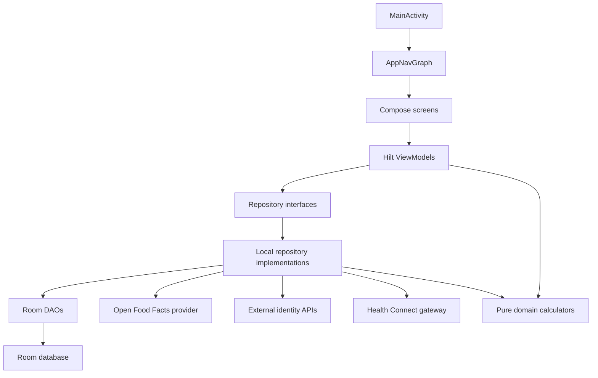

# MusFit App Architecture

This documentation describes the current MusFit Android app architecture as implemented in source on 2026-07-03. It is intended for product planning, engineering handoff, and future feature work.

Related documents:

- [Full app architecture audit — 2026-07-10](app-architecture-audit-2026-07-10.md)
- [Architecture remediation backlog — 2026-07-10](architecture-remediation-backlog-2026-07-10.md)
- [Screen contracts](screen-contracts.md)
- [Data models](data-models.md)

## Product Shape

MusFit is an Android-only, local-first fitness and nutrition tracker. The app is inspired by the information architecture of food trackers and training loggers, but uses original UI and app-specific models.

Top-level navigation is a bottom bar with four destinations:

| Destination | Route | Purpose |
| --- | --- | --- |
| Today | `today` | Daily dashboard, rings, coaching cues, weekly goals, and shortcuts into feature areas. |
| Food | `food` | Food diary, add food flow, saved foods, barcode lookup, nutrition goals, water, templates, recipes, shopping list, and food Health Connect sync. |
| Training | `training` | Routines, exercise library, active workouts, rest timer, supersets, PR/plate hints, workout history/recaps, progress, and quick set logging. |
| Health | `health` | Health Connect status, permission entrypoint, recent health import, and workout export. |

The MVP is local-first. It has a local account ownership boundary with optional Google/GitHub identity sign-in, but no cloud sync, analytics, subscription layer, social features, or wearable cloud API integration.

## Platform

| Area | Implementation |
| --- | --- |
| Language | Kotlin |
| UI | Jetpack Compose with Material 3 |
| Navigation | Navigation Compose, single activity |
| State | Hilt ViewModels exposing immutable `StateFlow` UI state |
| Storage | Room local database, schema version 30 |
| Async | Kotlin coroutines and Flow |
| DI | Hilt |
| Food remote data | Retrofit and Moshi client for Open Food Facts |
| Account identity | AndroidX Credential Manager for Google and GitHub device flow via Retrofit; OAuth client IDs are supplied through Gradle properties or environment variables. |
| Image loading | Coil Compose |
| Barcode and label scan | CameraX plus ML Kit barcode/text recognition |
| Health data | Android Health Connect boundary |
| Min/target SDK | minSdk 28, targetSdk 37 |
| Application id | `com.musfit` |

## Source Layout

| Path | Responsibility |
| --- | --- |
| `app/src/main/java/com/musfit/MainActivity.kt` | Single Android entry activity. Applies `MusFitTheme` and hosts `AppNavGraph`. |
| `app/src/main/java/com/musfit/MusFitApplication.kt` | Hilt application entrypoint. |
| `app/src/main/java/com/musfit/ui/` | Compose screens, navigation, UI state, and ViewModels. |
| `app/src/main/java/com/musfit/ui/theme/` | Material 3 theme and MusFit semantic color, spacing, shape, and typography tokens. |
| `app/src/main/java/com/musfit/data/repository/` | Feature repository interfaces, local implementations, and public repository data models. |
| `app/src/main/java/com/musfit/data/local/` | Room database, DAOs, entities, and query projection rows. |
| `app/src/main/java/com/musfit/data/remote/food/` | Open Food Facts provider interface and Retrofit implementation models. |
| `app/src/main/java/com/musfit/data/remote/auth/` | GitHub OAuth device flow Retrofit API models. |
| `app/src/main/java/com/musfit/domain/` | Pure Kotlin domain models and calculators. No Android, Compose, Retrofit, Room, or Health Connect dependencies. |
| `app/src/main/java/com/musfit/integrations/healthconnect/` | Android Health Connect gateway, record mapping, and permission rationale activity. |
| `app/src/test/java/com/musfit/` | Unit tests for ViewModels, repositories, DAOs, domain calculators, and integration boundaries. |
| `app/schemas/com.musfit.data.local.MusFitDatabase/` | Exported Room schema JSON files for versions 1 through 30. |

## Layering

Dependencies flow inward from UI to data sources. Domain helpers stay pure and are used from repositories and ViewModels where appropriate.



## App Bootstrap And Navigation

`MusFitApplication` is annotated with `@HiltAndroidApp`. `MainActivity` is annotated with `@AndroidEntryPoint`, sets light system-bar appearance, and calls:

```kotlin
setContent {
    MusFitTheme {
        AppNavGraph()
    }
}
```

`AppNavGraph` owns a `NavController`, renders the bottom `NavigationBar`, and defines routes:

- `today`
- `food`
- `training`
- `health`
- `barcode-scanner`
- `nutrition-label-scanner`

Barcode and nutrition-label scanner routes return simple strings through `rememberSaveable` state held in `AppNavGraph`. `FoodScreen` receives those strings as parameters, forwards them into `FoodViewModel`, then calls consume callbacks so the same scan is not processed twice.

## Dependency Injection

Hilt modules live under `core/di`.

| Module | Responsibility |
| --- | --- |
| `DatabaseModule` | Builds `MusFitDatabase`, registers all migrations, and provides DAOs. |
| `RepositoryModule` | Binds repository interfaces to local implementations: Account, ExternalAuth, Food, Training, Health, Goals. |
| `NetworkModule` | Provides Moshi, OkHttp, auth config, Open Food Facts Retrofit API, GitHub auth Retrofit API, and binds `FoodProductProvider`. |
| `HealthModule` | Binds `HealthConnectGateway` to `HealthConnectManager`. |

Repositories are injected into ViewModels. DAOs, remote providers, and gateways are injected into repository implementations.

## State Management

Each feature screen follows the same general pattern:

1. A `@HiltViewModel` owns a private `MutableStateFlow`.
2. The public UI contract is `val state: StateFlow<...UiState> = mutableState.asStateFlow()`.
3. Compose screens call `collectAsState()`.
4. User events call ViewModel methods.
5. ViewModels call repository methods inside `viewModelScope.launch`.
6. Repository reads are exposed as `Flow` and collected by the ViewModel.

Food and Today use date-scoped Flow collection. Food owns a `selectedDateFlow` and switches diary, plan, and water streams with `flatMapLatest`.

## Persistence

The database is `MusFitDatabase`, version 30, with `exportSchema = true`.

Major table groups:

- Account: local account identity, active account session, provider metadata, and optional Google/GitHub remote identity key.
- Food: foods, servings, meals, meal items, barcode products, goals, quick presets, meal definitions, templates, recipes, shopping list, water entries, food Health Connect sync state.
- Training: exercises, routines, routine exercises, workout sessions, workout sets with set type, RPE, notes, completion state, optional superset grouping, and local tool settings.
- Health: body metrics, daily health summaries, Health Connect sync state.
- Today goals: user goals.

Room migrations are registered from version 1 to 30 in `DatabaseModule`. The app does not use destructive migration fallback, so schema changes must include a migration and a committed schema JSON.

### Training Persistence Notes

Training stores only local strength-training data. Exercise rows hold list metadata plus detail fields (`primaryMuscles`, `secondaryMuscles`, `instructions`, and `localNotes`). Routines store starter/custom status, optional `programName`, and CSV-backed tags, with ordered routine exercises in `routine_exercises`. Active and completed workouts use the same session/set tables, with session `status` separating active, completed, and discarded workouts. Completed workout recap data is derived from the session and completed set rows, including local session notes. Supersets are represented by a nullable `supersetGroupId` on workout sets and are derived into grouped UI models by the repository. Global Training tool settings live in `training_settings` for default rest duration, bar weight, and available plate inventory.

## Remote And Device Integrations

### Account Identity

The account system is local-first. `AccountRepository` owns local account rows and the active-account pointer. Google and GitHub sign-in only link an external identity to the local account row; access tokens are not persisted and cloud sync is not implemented.

- Google sign-in uses AndroidX Credential Manager with `GetSignInWithGoogleOption`. Set `MUSFIT_GOOGLE_WEB_CLIENT_ID` as a Gradle property or environment variable to enable the button.
- GitHub sign-in uses the OAuth device flow and `read:user user:email` scope. Set `MUSFIT_GITHUB_OAUTH_CLIENT_ID` as a Gradle property or environment variable to enable the button.
- Provider identities are stored in `accounts.remoteUserId` as provider-scoped keys such as `google:<id>` or `github:<id>`, with `authProvider` used for display/state.

### Open Food Facts

Food product lookup is hidden behind `FoodProductProvider`.

- `lookupBarcode(barcode)` returns `ProductLookupResult.Found`, `NotFound`, or `Failed`.
- `searchProducts(query, pageSize)` returns `ProductSearchResult.Success` or `Failed`.
- The Retrofit API calls `https://world.openfoodfacts.org/api/v2/product/{barcode}.json` and `https://search.openfoodfacts.org/search`.

### Camera And ML Kit

`BarcodeScannerScreen` uses CameraX preview and ML Kit barcode recognition for EAN/UPC formats. `NutritionLabelScannerScreen` uses CameraX preview and ML Kit text recognition, returning raw OCR text to Food. The Food domain parser then performs best-effort macro extraction and still requires user review before save.

### Health Connect

Health Connect is behind `HealthConnectGateway`.

The app currently supports:

- Status and permission availability checks.
- Reading recent steps, calories, distance, sleep, exercise sessions, weight, body fat, and resting heart rate.
- Exporting completed workouts.
- Food and hydration export boundary through `HealthConnectFoodExportPayload`.

The Food sync card handles availability, permission summary, enable/disable state, last sync, and sync errors.

## Theme And Design System

`MusFitTheme` wraps Material 3 with semantic MusFit tokens:

- `MusFitColors`
- `MusFitSpacing`
- `MusFitShapes`
- `MusFitTypography`

The current implementation ships light and dark token sets, selected through
`isSystemInDarkTheme()`. The app uses a stable-Compose interpretation of
Material 3 Expressive: standard `MaterialTheme`, fixed MusFit tab accents,
Google Sans Flex display/title type, rounded content cards, and spring motion
tokens.

Design-system guidance:

- [Material 3 Expressive reference](../design/material-3-expressive.md)
- [MusFit design system](../design/musfit-design-system.md)
- [Food UI guidelines](../design/food-ui-guidelines.md)

UI direction:

- Dense, practical app surfaces.
- Original layouts and assets.
- Material 3 controls and Compose-native interaction.
- Food gets the most polish and is currently the largest feature area.

## Testing Strategy

| Test type | Location | Purpose |
| --- | --- | --- |
| ViewModel tests | `app/src/test/java/com/musfit/ui/...` | UI state and action behavior using fake repositories/providers. |
| Repository tests | `app/src/test/java/com/musfit/data/repository/...` | Local repository behavior against in-memory Room. |
| DAO/database tests | `app/src/test/java/com/musfit/data/local/...` | Room migrations, schemas, queries, and persistence behavior. |
| Domain tests | `app/src/test/java/com/musfit/domain/...` | Pure calculator and parser behavior. |
| Integration-boundary tests | `app/src/test/java/com/musfit/integrations/...` | Health Connect mapping and gateway assumptions. |

Windows verification command:

```powershell
. .\scripts\android\android-env.ps1
.\gradlew.bat testDebugUnitTest lintDebug assembleDebug --no-daemon --console=plain
```

## Architectural Decisions

- Keep the app Android-only and local-first.
- Keep feature state in ViewModels, not Composables, except for local presentation state such as expanded menus.
- Keep repository interfaces as the boundary between UI state and persistence.
- Keep domain calculators pure and small.
- Keep Health Connect and Open Food Facts replaceable behind interfaces.
- Prefer Flow from DAOs to ViewModels for live UI updates.
- Use Room transactions for multi-step writes.
- Store food nutrition primarily per 100 g and derive logged quantities from gram amounts.
- Avoid adding cross-cutting abstractions until the existing feature files create a concrete need.
