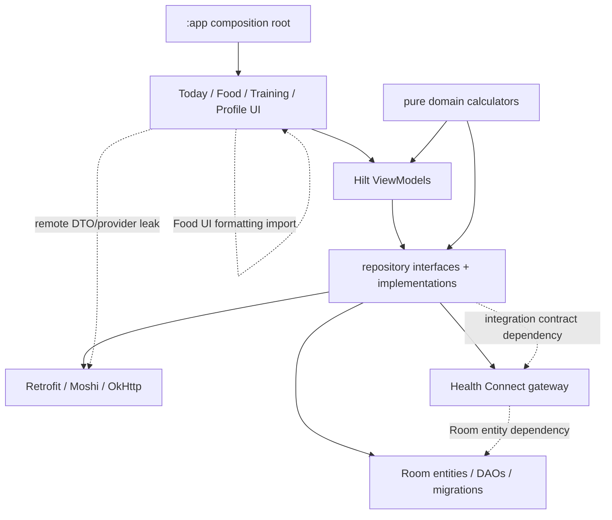
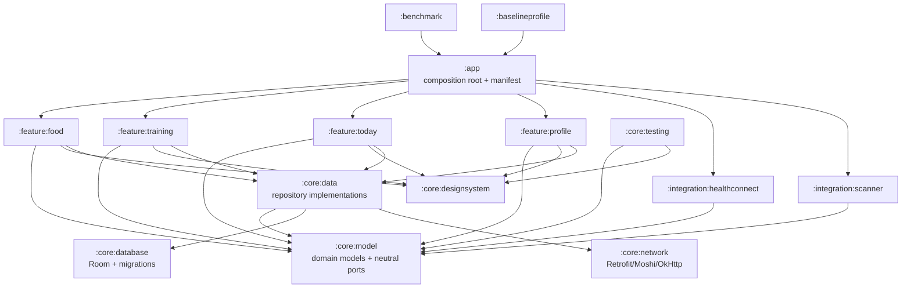

# Full MusFit App Architecture Audit — 2026-07-10

## Audit contract

This is a point-in-time, source-derived audit of commit
`23e45544cef22c55d44959ad1abe5e808b565154` (`origin/master` when the audit
branch was created). Source, generated outputs, executed tests, runtime traces,
and query plans are evidence. Older architecture prose is context only and is
not treated as source truth.

The audit PR is documentation-only. It does not change public Kotlin APIs,
Room schema, navigation contracts, manifests, build variants, or production
behavior. Raw traces, screenshots, database experiments, and reports remain
ignored under `build/reports/architecture-audit/`; only privacy-safe summaries
are committed.

Severity is interpreted as follows:

- **P0** — verified data-loss, security, release-integrity, or blocking correctness risk.
- **P1** — major reliability, accessibility, performance, or architectural constraint.
- **P2** — significant maintainability, testability, efficiency, or modernization debt.
- **P3** — bounded polish or emerging-platform opportunity.

Confidence is **Confirmed** for direct source/runtime proof, **Measured** for a
repeatable quantitative observation, and **Advisory** for a justified target
that still requires a product or platform adoption decision. Sizes are S, M,
or L; no XL item is handed off without being split in the remediation backlog.

## Executive outcome

The app has a strong local-first functional core and a substantial unit-test
suite, but it is not currently safe to distribute as the assumed optimized
Obtainium APK or Play-ready AAB. Three P0 issues lead the backlog:

1. CI distributes a debuggable APK and there is no signed, optimized production lane.
2. That distributed APK exports an unpermissioned receiver that can erase and reseed the database; an external adb broadcast reproduced the reset.
3. parent-row `INSERT OR REPLACE` writers can delete dependent rows or fail normal edits; an executable SQLite reproduction deleted a food's servings and failed for a referenced food.

The largest P1 constraints are incomplete account ownership, non-idempotent and
deletion-blind Health Connect sync, absent device/UI/performance harnesses,
oversized Food/Training state domains, missing process restoration, eager
Compose collections, incomplete edge-to-edge/accessibility behavior, and a
single module that cannot enforce the intended boundaries.

Finding count: **3 P0, 27 P1, 18 P2, and 1 P3**. The follow-up document
[Architecture remediation backlog](architecture-remediation-backlog-2026-07-10.md)
turns every finding into dependency-ordered, one-agent/one-PR packages.

## Measured baseline

### Toolchain, graph, and source size

| Area | Reviewed state |
| --- | --- |
| Build toolchain | Gradle 9.4.1, AGP 9.2.1, Kotlin 2.3.10, JDK 17.0.19 |
| Android | min SDK 28, compile/target SDK 37 |
| Modules | one production module: `:app` |
| Dependency graph | 232 unique resolved runtime modules; all UI, Room, network, scanner, Health Connect, DI, and tests share `:app` |
| Main source | 127 Kotlin files; 43,308 physical / 40,390 nonblank lines |
| Local tests | 72 Kotlin files; 22,394 physical / 19,752 nonblank lines; 72 executed suites |
| State/data surface | 8 Hilt ViewModels, 10 repository interfaces, 9 DAOs, 36 Room entities, 58 `@Transaction` declarations |
| Room | schema 35; exported schemas 1–35; every production hop registered; no destructive fallback |
| Source sets | `main`, `debug`, and tests; no hardened internal flavor and no `androidTest` source files |

Largest production files show where coordination and test-coupling cost is concentrated:

| File | Physical lines |
| --- | ---: |
| `ui/food/FoodViewModel.kt` | 6,872 |
| `ui/food/FoodModalSheets.kt` | 2,909 |
| `data/repository/FoodRepository.kt` | 2,596 |
| `ui/training/TrainingRoutineContent.kt` | 2,554 |
| `ui/food/FoodScreen.kt` | 2,215 |
| `data/repository/TrainingRepository.kt` | 1,877 |
| `ui/training/TrainingViewModel.kt` | 1,750 |
| `ui/training/TrainingActiveWorkoutContent.kt` | 1,457 |
| `ui/food/FoodAddPanelUi.kt` | 1,299 |
| `ui/training/TrainingScreen.kt` | 1,149 |
| `core/di/DatabaseModule.kt` | 976 |

### Current dependency shape



The pure `domain` direction is sound. The dashed edges are the concrete cycles
or leaks that must be removed before extracting modules.

### Build and verification evidence

| Evidence | Result |
| --- | --- |
| Clean `testDebugUnitTest lintDebug assembleDebug` | passed in about 184.2 s |
| Warm repeat of the same gate | passed in 9.455 s |
| Tests | 673 tests, 72 suites, 0 failures/skips; test execution 13.872 s |
| `assembleRelease bundleRelease` | passed in 121.5 s; both outputs unsigned |
| `lintRelease` | passed in 86.743 s; 27 findings |
| `lintDebug` | passed with 29 findings, including exported receiver, insecure base network configuration, and kapt usage |
| Configuration cache | first 11.249 s, reused 6.651 s; one stored problem from build-script `ProcessBuilder("git", "rev-list", "--count", "HEAD")` |
| Workflow contract | `scripts/dev/test-dev-workflow.ps1` failed because it still requires Room/schema 30 while source is 35 |
| Release optimization | no R8 minification, resource shrinking, mapping, usage report, or production signing configuration |

### APK and AAB composition

| Artifact/category | Compressed bytes | Notes |
| --- | ---: | --- |
| Debug APK | 158,523,024 | debuggable CI/Obtainium artifact |
| Unsigned release APK | 134,924,062 | non-debuggable, unminified, universal four-ABI APK |
| Unsigned release AAB | 49,420,998 | compiles, but no upload signing/promotion lane |
| Release APK DEX | 69,584,176 | five uncompressed DEX files |
| Release APK native libraries | 61,458,608 | x86 17,737,788; x86_64 17,600,496; arm64-v8a 16,058,784; armeabi-v7a 10,061,540 |
| Release APK assets | 2,286,426 compressed | includes 2,367,691 uncompressed ML model assets in the AAB |
| Release APK resources | 1,258,752 compressed | `res/` plus `resources.arsc` |
| AAB DEX | 20,807,851 compressed | 69,584,176 uncompressed |
| AAB native libraries | 25,911,957 compressed | x86 7,116,086; x86_64 6,942,014; arm64-v8a 6,533,075; armeabi-v7a 5,320,782 |

The largest native entries are ML Kit OCR pipeline and barcode libraries,
repeated for all four ABIs. `material-icons-extended` defines 11,379,118 DEX
bytes—32.2% of defined DEX code bytes—while source imports only 66 icons. The
merged dependency baseline profile has 6,488 rules and zero `com/musfit`
rules. Quantitative R8 blast-radius analysis is deliberately deferred until a
minified release exists.

### Room write and query-plan evidence

An in-memory SQLite database created from exported schema 35 reproduced the
Food parent-write defect:

- replacing an unreferenced food left `0` rows in `food_servings` because the parent replacement fired `ON DELETE CASCADE`;
- replacing a logged/referenced food failed with `FOREIGN KEY constraint failed` because diary/template/recipe references use restrictive foreign keys.

Representative `EXPLAIN QUERY PLAN` results:

| Query | Plan result |
| --- | --- |
| body metrics by type and time | full scan plus temporary B-tree |
| case-insensitive saved-food name/brand search | full `foods` scan |
| meals by date/type/time | date index only plus temporary B-tree |
| filtered exercise search | full scan plus temporary B-tree |
| latest completed workout | status index plus correlated subquery and temporary B-tree |

Repository invalidations add application-level N+1 work: Food loads servings
once per food (`FoodRepository.kt:679-684`), while active Training loads two
history queries per distinct exercise (`TrainingRepository.kt:1690-1713`).

### Runtime evidence

The deterministic emulator was `MusFit_API36` / `emulator-5554`, 1080×2400 at
420 dpi (about 411×914 dp), seeded once and then reused. The release APK was
aligned and locally signed with the same public debug certificate solely to
replace the debug install without clearing the seed. That certificate is not a
distribution recommendation.

#### Startup timing

| Build/device | Samples | Min | Median | P90 | Max |
| --- | ---: | ---: | ---: | ---: | ---: |
| distributed debug, API 36 emulator, force-stopped | 10 | 2,024 ms | 2,093.5 ms | 2,322 ms | 2,426 ms |
| locally signed non-debuggable release, same emulator/database | 10 | 576 ms | 644 ms | 763 ms | 983 ms |
| currently installed debug, Pixel 8 Pro/API 37, force-stopped | 6 valid | 1,109 ms | 1,224.5 ms | 1,241 ms | 1,241 ms |

The emulator release median was 69.2% lower than debug. This is a manual
baseline, not a benchmark claim. One Pixel sample returned an invalid
`TotalTime=0` with a 3,030 ms wait and was excluded.

For warm task resume, Android returned `TotalTime=0`; host wall/`WaitTime` are
therefore coarse only. Debug median wait/wall was 33/88 ms; release was
36.5/90 ms. There is no meaningful warm-resume difference in this sample.

#### Frame and memory snapshots

| Journey/build | Frames / jank | P90 | Total PSS / RSS |
| --- | --- | ---: | ---: |
| Food diary → scroll → Add/search, debug emulator | 355 / 21.69% | 53 ms | 156,124 / 300,000 KB |
| Food diary → scroll → Add/search, release emulator | 1,208 / 1.32% | 26 ms | 88,637 / 238,184 KB |
| Training → active workout → set/rest UI, debug emulator | 528 / 1.70% | 27 ms | 158,979 / 303,192 KB |
| Training → active workout → set/rest UI, release emulator | 763 / 2.23% | 29 ms | 92,181 / 242,212 KB |
| Profile → trends/settings, debug emulator | 413 / 4.84% | 30 ms | 153,398 / 298,548 KB |
| Profile → trends/settings, release emulator | 1,230 / 9.59% | 42 ms | 78,167 / 225,704 KB |
| Pixel debug, first Food/Training/Profile tab+scroll pass | 79 / 18.99% | 81 ms | 277,189 / 401,340 KB |
| Pixel debug, immediate repeat | 116 / 10.34% | 20 ms | 281,861 / 407,084 KB |

The scripts do not produce identical frame populations, so cross-row jank
percentages are diagnostic rather than acceptance thresholds. The consistent
release memory reduction and cold-start delta justify a release-like benchmark
lane; they do not identify a single optimization by themselves.

#### Perfetto

Three release-like traces cover Food, Training, and Profile. Under tracing,
cold startup was 1,158–1,218 ms. The Android startup metric reported no
baseline/cloud profile. A 37.770 ms startup Binder wait was traced into
`system_server` WindowManager/ActivityManager monitor contention, not MusFit
application work.

The Food transition contained a `Compose:recompose` slice lasting 602.801 ms
with 506.000 ms on CPU; the exact main-thread window was 506.000 ms Running,
95.516 ms Runnable, and 1.284 ms sleeping. Profile navigation contained a
352.631 ms/328.644 ms wall/CPU recomposition. RenderThread slices were also
large, but the AVD uses Google SwiftShader, so trace frame-jank percentages and
RenderThread cost require hardware confirmation. No trace-length I/O or
uninterruptible-sleep stall was found.

### Configuration/device matrix

| Scenario | Result |
| --- | --- |
| compact, medium (600 dp), expanded (900 dp) | rendered, but all retained the same full-width single-column information architecture |
| landscape | rendered with large unused width and no adaptive navigation/panes |
| dark mode | app content rendered; status-bar icons remained dark on a dark background |
| 1.5× font | Today remained scrollable and usable; the title wrapped; broader screens have no regression harness |
| RTL/pseudo-locale | an `ar-XB` app locale produced no translated resources and the reviewed screen remained visually LTR |
| IME | Food search keyboard path worked; source contains no explicit IME inset handling for deep forms |
| denied camera | system permission prompt rendered and the app remained responsive |
| denied Health Connect | settings exposed the permission/enable state; Food write permissions are absent from the manifest |
| offline | Today and local Food search did not crash; the tested empty search gave no explicit offline explanation |
| process recreation | after killing the background release process, Food Add/search state and query were lost and the app returned to Today |

The Pixel 8 Pro was used only for launch, tab navigation, scrolling, memory,
and frame counters. No reset, seed, Health export, permission change, or
Food/Training record mutation was performed.

## Strengths and keep decisions

- Keep the Android-only, local-first product boundary and Room as the local source of truth.
- Keep the pure domain dependency direction; no domain imports from UI, data, integrations, Room, Retrofit, or Compose were found.
- Keep exported schemas 1–35, explicit migrations, and the absence of destructive migration fallback.
- Keep transactional multi-row Food/Training mutations, while replacing unsafe parent `REPLACE` writers.
- Keep account-reactive `flatMapLatest` behavior already present for profile, goals, settings, and AI data.
- Keep runtime Hermes keys encrypted with AES-256-GCM in Android Keystore; remove only the compiled debug default.
- Keep GitHub tokens transient, HTTP body logging disabled, backup disabled, and database exclusion from transfer/cloud backup.
- Keep the narrow main component surface: launcher plus required Health rationale surfaces; no production services, providers, dynamic receivers, PendingIntents, or nested-intent forwarding were found.
- Keep CameraX `STRATEGY_KEEP_ONLY_LATEST`, guaranteed `ImageProxy.close()`, and ML Kit/executor cleanup while fixing delayed provider binding.
- Keep Food date switching/stale-result guards and Open Food Facts cancellation rethrow behavior.
- Keep stable keys in the existing lazy lists and the ongoing Food file/editor-state split; do not split mechanically per sheet.
- Keep visit-order top-level back behavior and its tests during navigation migration.
- Keep rest timers screen-scoped: closing the active-workout screen must continue to stop them.
- Keep pinned direct dependency versions, centralized repositories, `FAIL_ON_PROJECT_REPOS`, non-transitive R classes, minimal CI permissions, and superseded-run cancellation.
- Keep stable APIs first. No experimental adaptive API is currently embedded in production code.

## Staged target topology

Boundaries below are justified by current dependency clusters. This deliberately
avoids per-screen modules and follows the official
[Android modularization guide](https://developer.android.com/topic/modularization).



Extraction order matters: clean neutral contracts and feature leaks; add build
conventions; extract model/design/testing; extract database/network; isolate
Health/scanner; then move coarse top-level features. `:app` remains the
composition root. A feature may expose an entry provider and typed actions, but
must not import another feature implementation.

## Platform modernization decisions

- Follow current [Android architecture recommendations](https://developer.android.com/topic/architecture/recommendations): lifecycle-aware collection, a clear source of truth, unidirectional state, and testable data boundaries.
- Treat stable [Navigation 3](https://developer.android.com/guide/navigation/navigation-3) as a staged migration candidate, not a rewrite. First add restoration/back/deep-flow coverage; then introduce serializable `NavKey`s, `rememberNavBackStack`, `NavDisplay`, typed results, and feature entry providers while preserving visit-order semantics.
- After Navigation 3 parity, use stable Material adaptive navigation and list-detail scenes for source-justified Food/Training relationships. Compact behavior must remain unchanged.
- Use Activity [edge-to-edge guidance](https://developer.android.com/develop/ui/compose/system/setup-e2e) now; target SDK 37 makes this correctness work, not visual polish.
- Add official [Macrobenchmark](https://developer.android.com/topic/performance/benchmarking/macrobenchmark-overview) and [Baseline Profile](https://developer.android.com/topic/performance/baselineprofiles/create-baselineprofile) modules before setting performance budgets.
- Keep MediaQuery, non-lazy Grid, and FlexBox APIs in a watchlist. Adoption requires stable release status, an unmet user scenario, test/benchmark coverage, min-SDK compatibility, and an ADR with rollback.

## Audit coverage map

Every requested area has a finding or an explicit keep conclusion.

| Area | Outcome |
| --- | --- |
| Modules, direction, visibility, DI, isolation | ARCH-001, ARCH-002; pure domain direction is a keep |
| State, Flow, cancellation, lifecycle, restoration | UI-001, UI-002, NAV-002, DATA-005; Food stale guards are a keep |
| Navigation, predictive back, adaptive | NAV-001, UI-007, PLAT-001 |
| Compose recomposition/lazy/image/camera | UI-001, UI-003, UI-004, UI-005; existing lazy keys/camera backpressure are keeps |
| Edge-to-edge, IME, large font, RTL/localization | UI-006, A11Y-003 |
| Accessibility | A11Y-001, A11Y-002, TEST-003 |
| Room writes, constraints, transactions, migrations | DATA-001, DATA-003, TEST-001; transactions/schema exports are keeps |
| Ownership, deletion, privacy | DATA-002, DATA-006; backup/Keystore/token handling are keeps |
| Indexes, query plans, N+1 | DATA-004 |
| Health Connect | HC-001 through HC-006; availability checks/zone-aware day ranges are keeps |
| Network, exported components, credentials | SEC-001 through SEC-003; main intent surface and disabled logging are keeps |
| Signing, release separation, R8, ABI, reproducibility | REL-001 through REL-004, PERF-002 |
| CI, observability, tests, documentation drift | BUILD-004, BUILD-006, TEST-001 through TEST-006, ARCH-003 |
| Dependency/supply chain | BUILD-005, REL-004; exact versions/central repositories are keeps |

## Finding register

The detailed handoff specifications below use this stable ID set.

| Severity | IDs |
| --- | --- |
| P0 | REL-001, SEC-001, DATA-001 |
| P1 | REL-002, REL-003, SEC-002, SEC-003, DATA-002, HC-001, HC-002, HC-003, HC-004, ARCH-002, ARCH-003, BUILD-002, BUILD-004, PERF-001, PERF-002, TEST-001, TEST-002, TEST-003, TEST-005, NAV-002, UI-001, UI-003, UI-004, UI-005, UI-006, A11Y-001, A11Y-002 |
| P2 | REL-004, ARCH-001, BUILD-003, BUILD-005, BUILD-006, PERF-003, TEST-004, TEST-006, DATA-003, DATA-004, DATA-005, DATA-006, HC-005, HC-006, NAV-001, UI-002, UI-007, A11Y-003 |
| P3 | PLAT-001 |

## Detailed findings and acceptance contracts

The default full gate for every remediation PR is:

```powershell
. .\scripts\android\android-env.ps1
.\scripts\dev\verify-musfit.ps1 -Preset Full
```

Each PR must also run `git diff --check`, install/reset the seeded API 36
emulator where its scenario permits, and retain focused test/report evidence.
Performance conditions are evaluated on the future release-like benchmark
variant unless a finding names a simpler deterministic counter.

### REL-001 — No production-safe distribution lane

- **Meta:** Release engineering; **P0 · Confirmed · L**.
- **Evidence:** `app/build.gradle.kts:65-99` configures a public debug key but no release signing/minification; `.github/workflows/android.yml:37-80` publishes `app-debug.apk`; release APK/AAB builds succeeded but were unsigned.
- **Impact:** the only OTA artifact is debuggable and cannot provide production update integrity or a Play-ready promotion path.
- **Target/constraints/risk:** separate internal and production variants; sign APK/AAB from CI secrets, publish checksums, and promote only verified commits. Existing installs use the public debug certificate, so key transition is a compatibility decision, not an in-place Gradle toggle.
- **Dependencies:** REL-002, SEC-001, SEC-002, SEC-003; product approval of install migration.
- **Acceptance/tests:** release manifest is non-debuggable and contains no seed/debug network surface; `apksigner verify` and AAB signature verification pass; workflow contract tests prove publication cannot bypass gates.
- **Device/performance:** install the production-shaped artifact on a clean API 28/37 device and the migration build on an existing debug-signed install; cold/frame P90 must not regress more than 10% from the approved benchmark baseline.

### SEC-001 — Distributed debug receiver can erase all app data

- **Meta:** Component security/data loss; **P0 · Confirmed · M**.
- **Evidence:** `app/src/debug/AndroidManifest.xml:3-8` exports `MusFitDebugSeedReceiver` without permission; `MusFitDebugSeedReceiver.kt:55-82` calls `clearAllTables()` for `reset=true`; CI distributes that source set. An external adb broadcast returned success and reset/reseeded the installed debug database.
- **Impact:** another installed app can invoke the explicit component and destroy or replace user data.
- **Target/constraints/risk:** move seeding to instrumentation or a non-distributed internal interface that ordinary apps cannot invoke; keep deterministic emulator seeding.
- **Dependencies:** coordinate source-set names with REL-001; otherwise none.
- **Acceptance/tests:** a separate-package probe is rejected; Obtainium/production merged manifests have no seed component/action; the approved seed helper still works.
- **Device/performance:** prove denial and then successful approved seeding on API 36; seed completes within the helper timeout without ANR.

### DATA-001 — Parent `REPLACE` writes delete children or reject edits

- **Meta:** Room correctness/data loss; **P0 · Confirmed · M**.
- **Evidence:** `FoodDao.kt:659-719` and `TrainingDao.kt:483-535` use `OnConflictStrategy.REPLACE` on parent rows; generated DAO code emits `INSERT OR REPLACE`. Schema-35 SQLite reproduction deleted `food_servings` for an unreferenced food and raised a foreign-key failure for a logged food.
- **Impact:** favorite/edit operations can silently lose custom servings or fail on foods/routines/sessions/templates/recipes/chat threads with dependents.
- **Target/constraints/risk:** replace parent writers with true `@Upsert`/targeted `@Update`; retain child `REPLACE` only when intentional graph replacement is proved and transacted. Preserve schema and public repository behavior.
- **Dependencies:** complete before account-ownership migrations; Food and Training/AI halves can be separate PRs.
- **Acceptance/tests:** relationship-preservation tests cover food servings, diary, barcode, recipe/template items, routine/session sets, and chat messages; rollback retains the original graph.
- **Device/performance:** edit/favorite referenced seeded entities and relaunch; scalar parent update remains O(1) and performs no child rewrite.

### REL-002 — Production signing cannot update existing public-debug-key installs

- **Meta:** Release compatibility; **P1 · Confirmed · M**.
- **Evidence:** debug and production-shaped outputs share `com.musfit`; current emulator and Pixel installs are version 458 signed/debuggable with the committed public debug certificate.
- **Impact:** a secure production key cannot update those installs, while reusing the public key would permanently compromise update integrity.
- **Target/constraints/risk:** give internal builds `com.musfit.internal`; define an explicit export/import, one-time bridge, or approved reset for existing `com.musfit` users; never commit production keys.
- **Dependencies:** REL-001 and account/data-erasure policy.
- **Acceptance/tests:** an upgrade matrix documents every supported path and proves retained data or explicitly approved reset behavior; CI secret scans show no private key material.
- **Device/performance:** exercise migration on a copy of an existing debug-signed install; import/export duration and file size have documented budgets and no plaintext credentials.

### REL-003 — Release is unminified, unshrunk, and universal

- **Meta:** Release size/performance; **P1 · Measured · M**.
- **Evidence:** no R8/resource-shrink configuration or mapping exists; unsigned release APK is 128.67 MiB and carries four ABI copies; AAB is 47.13 MiB.
- **Impact:** excessive download/install size, more DEX verification, no obfuscation, and no quantitative keep-rule baseline.
- **Target/constraints/risk:** first enable full-mode R8/resource shrinking with critical-flow tests, then publish ABI-specific Obtainium APKs and Play splits. Preserve bundled/offline OCR and barcode models initially.
- **Dependencies:** REL-001 and PERF-001; R8 analyzer/blast-radius work starts only after minification exists.
- **Acceptance/tests:** minified scanner, Room, Moshi, Hilt, Health, auth, and process-restoration flows pass; mapping/usage/seeds are retained.
- **Device/performance:** arm64 Obtainium APK ≤60 MiB and AAB ≤40 MiB, or measured ML constraints are documented; startup/frame P90 does not regress >10%.

### SEC-002 — Distributed build permits cleartext bearer traffic to arbitrary hosts

- **Meta:** Network security; **P1 · Confirmed · M**.
- **Evidence:** `debug_network_security_config.xml:3-12` enables base cleartext; `DebugNetworkSecurityConfigTest.kt:7-16` requires it; `AiCoachRepository.kt:351-361` accepts arbitrary HTTP(S) hosts; `HermesCoachClient.kt:91-106` sends bearer credentials and chat content.
- **Impact:** endpoint mistakes or interception can expose the API key and health/chat context; the distributed build requests LAN capability unnecessarily.
- **Target/constraints/risk:** confine loopback/RFC1918 HTTP and local-network permission to internal builds with explicit consent; production requires TLS and rejects every public-host HTTP URL.
- **Dependencies:** REL-001 source-set design; independent of runtime key storage.
- **Acceptance/tests:** variant manifest and URL-policy tests cover IPv4/IPv6 loopback/private/public hosts; production has no cleartext/LAN permission.
- **Device/performance:** internal LAN and production HTTPS smoke tests pass; policy adds no measurable request setup regression.

### SEC-003 — A debug Hermes API key is compiled into the APK

- **Meta:** Credential handling; **P1 · Confirmed · S**.
- **Evidence:** `app/build.gradle.kts:50-57,93-97` loads `MUSFIT_DEBUG_HERMES_API_KEY` into `BuildConfig`; `AiCoachConfigModule.kt:16-21` injects it as the automatic default. The ignored local property is populated; its value is intentionally omitted.
- **Impact:** the bearer key is recoverable from generated sources, caches, and APK strings.
- **Target/constraints/risk:** remove all API secrets from BuildConfig and require runtime entry into the existing Keystore-backed store.
- **Dependencies:** may run with SEC-002 if file ownership is coordinated.
- **Acceptance/tests:** generated-source/APK scans contain no configured key; a fresh install has no implicit secret; Keystore entry/update/delete tests pass.
- **Device/performance:** enter a temporary key, use it, remove it, and verify no secret after reinstall; no performance condition beyond zero startup network work.

### DATA-002 — Account isolation excludes most personal data

- **Meta:** Ownership/privacy/correctness; **P1 · Confirmed · L**.
- **Evidence:** account switching exists in `AccountRepository.kt:54-206`, but Food, Training, Health, coach messages, and dashboard pins lack `accountId`; migration ownership covered only profile/settings/goals (`DatabaseModule.kt:583-623`).
- **Impact:** a second local/provider account can see and mutate the first user's diary, workouts, measurements, coach feed, and export inputs.
- **Target/constraints/risk:** add indexed ownership to personal rows; keep immutable reference catalogs shared and move user overlays to account scope; map legacy rows to `local-default` without duplication.
- **Dependencies:** DATA-001 first; coordinate stable Health IDs and deletion.
- **Acceptance/tests:** two-account integration tests prove isolation for every top-level feature and exports; migration retains all legacy data under one owner.
- **Device/performance:** switch accounts repeatedly on seeded API 36; scoped query P90/index plans must remain at least as efficient as current plans.

### HC-001 — Nutrition/hydration write permissions are absent from the manifest

- **Meta:** Health Connect correctness; **P1 · Confirmed · S**.
- **Evidence:** `AndroidManifest.xml:5-15` declares reads and `WRITE_EXERCISE`, but `HealthConnectManager.kt:65-68,325-328` requests nutrition/hydration writes; merged manifests confirm both declarations are missing.
- **Impact:** Food sync cannot obtain the permissions it needs to export meals or water.
- **Target/constraints/risk:** declare both permissions and keep the rationale synchronized; do not broaden requested access.
- **Dependencies:** pair with HC-006 rationale content.
- **Acceptance/tests:** merged-manifest contract, permission inventory test, and gateway tests pass.
- **Device/performance:** API 36 grants the permissions and exports one meal/water record; no measurable condition beyond correct single insertion.

### HC-002 — Health export identity is not fully stable or idempotent

- **Meta:** Health Connect correctness; **P1 · Confirmed · M**.
- **Evidence:** workout mapping uses `Metadata.manualEntry()` without client identity (`HealthConnectRecordMapper.kt:22-41`); repeated latest-workout exports insert again (`HealthRepository.kt:159-180`). Food IDs omit account identity and use lossy meal tokens (`HealthConnectRecordMapper.kt:44-116`).
- **Impact:** retries can duplicate workouts and future accounts/custom meal names can collide.
- **Target/constraints/risk:** derive client IDs from account plus immutable local entity/session IDs and monotonic versions; persist/reconcile provider IDs. Existing Health records need a compatibility policy.
- **Dependencies:** DATA-002; precedes HC-004.
- **Acceptance/tests:** unchanged retry leaves one record; edit updates it; two accounts and colliding labels remain distinct.
- **Device/performance:** fake and opt-in API 36 tests verify idempotency; export call count stays O(changed records).

### HC-003 — Failures and cancellation become stale successful imports

- **Meta:** Health Connect reliability; **P1 · Confirmed · M**.
- **Evidence:** `HealthConnectManager.kt:115-224` uses `runCatching(...).getOrNull()` and swallows cancellation; `HealthRepository.kt:112-144` merges null with cached values and records success.
- **Impact:** permission errors, provider failure, revocation, or cancellation can leave stale metrics while UI reports success.
- **Target/constraints/risk:** return typed complete/partial/failure results, rethrow cancellation, distinguish empty/deleted/unavailable, and transact metric/summary/sync-state writes.
- **Dependencies:** none for result model; coordinate with HC-004 source-of-truth rules.
- **Acceptance/tests:** total/partial failure, cancellation, revocation, and legitimate empty-data tests update only successful fields and preserve visible error state.
- **Device/performance:** revoke/deny on emulator without data mutation; cancellation stops within one second and refresh call count does not increase.

### HC-004 — Health sync has no deletion or reconciliation path

- **Meta:** Health Connect/data lifecycle; **P1 · Confirmed · L**.
- **Evidence:** `HealthConnectGateway.kt:28-29` exposes insert only; zero/removed Food data is omitted but never deletes authored records; imported cache fallback retains missing source values.
- **Impact:** deleting meals, water, workouts, accounts, or Health records leaves permanent divergence.
- **Target/constraints/risk:** define explicit source-of-truth/deletion rules and delete/reconcile by stable client ID; never delete manual local data on provider revocation.
- **Dependencies:** HC-002 and DATA-002; feeds DATA-006 erasure.
- **Acceptance/tests:** local deletion removes only MusFit-authored records; provider deletion/revocation clears or marks cache stale; retry is idempotent.
- **Device/performance:** opt-in Health sandbox scenario with created test records; reconciliation is proportional to changed IDs, not all historical data.

### ARCH-002 — Cross-feature and integration leaks block an acyclic module graph

- **Meta:** Dependency direction; **P1 · Confirmed · L**.
- **Evidence:** Food UI exposes remote provider DTOs (`FoodViewModel.kt:5,653`); Profile imports a Food UI extension (`ProfileViewModel.kt:24,326`); repositories import Health contracts while `HealthConnectGateway.kt:3` imports Room entities.
- **Impact:** planned feature/data/integration extraction creates cycles and transport details leak into UI contracts.
- **Target/constraints/risk:** map remote DTOs before ViewModels; move display labels to shared/resources; define neutral health/workout snapshots and inward-facing ports independent of Room.
- **Dependencies:** precedes ARCH-001 extraction and UI-001 decomposition.
- **Acceptance/tests:** architecture tests enforce zero feature-to-feature UI imports, zero UI→remote DTO imports, zero integration→Room entity imports, and no data→concrete adapter edge.
- **Device/performance:** behavior-neutral seeded smoke; compile graph improves without runtime regression.

### ARCH-003 — Architecture handoff prose is materially stale

- **Meta:** Documentation/agent safety; **P1 · Confirmed · M**.
- **Evidence:** source Room version is 35 while README says 30 and Food docs say 28; source route is Profile while docs say Health; docs claim `NavigationBar` while source uses custom chrome; Food ViewModel is 6,872 lines versus documented ~4,500.
- **Impact:** agents can implement against nonexistent routes, old migrations, or obsolete component contracts.
- **Target/constraints/risk:** generate/check stable facts from source and avoid volatile counts unless automated; preserve human architectural rationale separately.
- **Dependencies:** none; may run alongside code packages except where docs overlap.
- **Acceptance/tests:** drift test validates database version/latest schema, top destinations, component names, and documented command paths.
- **Device/performance:** documentation-only; full gate and workflow contract must pass, no runtime condition.

### BUILD-002 — Legacy kapt remains on the critical compile path

- **Meta:** Build performance/modernization; **P1 · Measured · M**.
- **Evidence:** `com.android.legacy-kapt`, three kapt processors, and `kaptGenerateStubs*`/`kapt*Kotlin` tasks are present; lint reports `KaptUsageInsteadOfKsp`.
- **Impact:** avoidable stub generation reduces incremental compilation efficiency.
- **Target/constraints/risk:** migrate Room/Hilt processors to KSP; remove AndroidX Hilt Work compiler if WorkManager remains unused; keep AGP built-in Kotlin setup.
- **Dependencies:** PERF-003 decision; safest before broad module moves.
- **Acceptance/tests:** no kapt tasks remain; schema 35 identity/export is unchanged; generated Hilt bindings and full gate pass.
- **Device/performance:** seeded launch/DI smoke; clean and incremental compile times must not regress, with the second measured build improved or neutral.

### BUILD-004 — Workflow contract validation is stale and red

- **Meta:** CI/tooling correctness; **P1 · Confirmed · S**.
- **Evidence:** `scripts/dev/test-dev-workflow.ps1` hardcodes schema/version 30 and fails against source/exported schema 35; CI does not run it.
- **Impact:** the documented canonical workflow can drift while PR verification remains green.
- **Target/constraints/risk:** derive facts from source/latest schema and execute the contract in CI; do not duplicate architecture prose as assertions.
- **Dependencies:** none.
- **Acceptance/tests:** helper passes current source, fails a deliberate mismatch fixture, and runs before publication.
- **Device/performance:** no device step; full gate remains within the current warm envelope.

### PERF-001 — There is no app-owned benchmark or baseline profile

- **Meta:** Performance engineering; **P1 · Measured · M**.
- **Evidence:** no `:benchmark`/`:baselineprofile`, benchmark dependency, profileable release-like target, or tasks; merged profile has zero MusFit rules. Manual debug/release startup differed by 69.2% on the same seed.
- **Impact:** performance decisions rely on noisy debug/manual evidence and production code receives no profile-guided compilation.
- **Target/constraints/risk:** add official Macrobenchmark and Baseline Profile modules against a production-shaped variant; keep raw benchmark results as CI artifacts.
- **Dependencies:** a non-debuggable benchmark variant from REL-001; can precede feature modularization.
- **Acceptance/tests:** profiles contain exercised `com/musfit` code; cold/warm startup and the three audited journeys run repeatedly; CI flags >10% approved-baseline regressions.
- **Device/performance:** API 28/37 managed devices plus Pixel validation; report median/P90/min/max and frame/memory metrics.

### PERF-002 — DEX/icons and four-ABI ML packaging dominate size

- **Meta:** Package efficiency; **P1 · Measured · M**.
- **Evidence:** 69.58 MB DEX, 61.46 MB native libraries, four ABI copies, and 11.38 MB of defined material extended-icon code for 66 imports; OCR/barcode binaries are the largest entries.
- **Impact:** download/install/storage and DEX verification costs are far above the app's feature-code footprint.
- **Target/constraints/risk:** enable R8 first, then replace the extended icon dependency with maintained vectors/subset and publish ABI-specific APKs; preserve offline ML behavior.
- **Dependencies:** REL-003 and PERF-001.
- **Acceptance/tests:** before/after ownership report, scanner/OCR smoke tests, no missing icon/vector resources.
- **Device/performance:** meet REL-003 budgets without >10% startup/frame regression or scanner accuracy/latency regression.

### TEST-001 — Migration/DAO safety is not validated on framework SQLite

- **Meta:** Data testing; **P1 · Confirmed · M**.
- **Evidence:** `app/src/androidTest` is absent; 30 suites use Robolectric; earliest full migration chain begins at v19, leaving v1–18 without executable full-chain coverage.
- **Impact:** old retained installs and SQLite/foreign-key behavior can fail despite green host tests.
- **Target/constraints/risk:** add Room `MigrationTestHelper` instrumentation from every supported schema to latest, recent adjacent migrations, representative DAO/FK/transaction tests, and a retained-version policy.
- **Dependencies:** before account ownership/schema changes.
- **Acceptance/tests:** API 28/37 managed-device tests validate schemas, sentinel rows, identities, and `PRAGMA foreign_key_check` for every supported path.
- **Device/performance:** migration has a documented time/size budget on a representative large database and never falls back destructively.

### TEST-002 — No Compose behavior, navigation, or automated E2E suite

- **Meta:** UI/reliability testing; **P1 · Confirmed · L**.
- **Evidence:** no Compose test dependency, `createComposeRule`, AndroidJUnit4 test, or instrumented user journey; current “UI” tests mostly exercise functions/state.
- **Impact:** rendered semantics, user actions, back, scanners, denied/offline states, and process restoration can regress undetected.
- **Target/constraints/risk:** add fake-backed local Compose tests plus a deliberately small managed-device E2E layer; avoid duplicating all unit behavior at E2E level.
- **Dependencies:** testing convention/core fixture package; precedes Navigation 3 and broad state refactors.
- **Acceptance/tests:** Food log, Training set/rest, Profile/settings, visit-order back, scanner round-trips, denial/offline, and process recreation run in CI; roughly 5% of tests are high-level.
- **Device/performance:** API 28/37 managed devices; E2E lane has a bounded runtime and publishes logs/screenshots on failure.

### TEST-003 — No screenshot, adaptive, or accessibility regression harness

- **Meta:** Visual/accessibility testing; **P1 · Confirmed · M**.
- **Evidence:** no goldens, preview/screenshot tasks, semantics matrix, or `androidTest`; manual 411/600/900 dp, landscape, dark, RTL, and 1.5× runs reproduced gaps.
- **Impact:** edge-to-edge, adaptive, localization, and accessibility remediation cannot be reviewed deterministically.
- **Target/constraints/risk:** add screen-level phone/foldable/tablet/desktop goldens plus component theme/font cases; references change only through explicit review.
- **Dependencies:** first UI remediation package.
- **Acceptance/tests:** deterministic CI matrix for 400/610/900 dp widths, representative heights, light/dark, LTR/RTL, and 1.5× font; image diffs are artifacts.
- **Device/performance:** screenshot lane is separate from Macrobenchmark; test runtime remains bounded and production APK is unaffected.

### TEST-005 — CI verifies only debug/local tests

- **Meta:** CI/release quality; **P1 · Confirmed · M**.
- **Evidence:** PR workflow runs debug unit/lint/assemble and publishes debug; it does not test release, managed devices, screenshots, migrations, benchmarks, signing, or API levels.
- **Impact:** a distributable artifact can bypass the checks that represent its behavior and security.
- **Target/constraints/risk:** PR lane adds workflow contract, debug/release lint/build; main/nightly runs device/migration/UI; performance owns benchmark/profile; release promotes a previously verified commit.
- **Dependencies:** REL-001 and Wave-2 harness packages.
- **Acceptance/tests:** every lane uploads actionable reports; publication has explicit `needs` on all required jobs and cannot rebuild an unverified commit.
- **Device/performance:** managed API 28/37 matrix and retained benchmark JSON; total PR latency target is documented, with heavier lanes nightly/release.

### NAV-002 — Critical route and draft state is not process-restorable

- **Meta:** Navigation/state reliability; **P1 · Measured · L**.
- **Evidence:** no `SavedStateHandle` exists; Food/Training states initialize in memory and several Profile forms use plain `remember`. In the release-like emulator, killing the background process while Food Add held query `zzzunknown` returned to Today and lost both route and draft.
- **Impact:** process death or rotation can discard selected dates, editors, form drafts, and feature-page position; duplicate writes are possible during reconstruction.
- **Target/constraints/risk:** define a restoration policy for route keys, IDs, selected dates, and bounded drafts using saveable state/`SavedStateHandle`; keep repository snapshots/loading/messages out of saved state. Active workout remains Room-owned and rest timers remain screen-scoped.
- **Dependencies:** TEST-002/003 before broad changes; precedes NAV-001.
- **Acceptance/tests:** rotate and background-kill every Food editor, Training routine/active workout, Profile editor, and scanner return; restore destination/draft without duplicate mutation.
- **Device/performance:** API 28/37 process-death suite; restored state payload remains small and restore-to-first-frame does not regress >10%.

### UI-001 — Food and Training are oversized state/recomposition domains

- **Meta:** State architecture/Compose performance; **P1 · Confirmed · L**.
- **Evidence:** `FoodUiState` has 117 constructor fields and a 6,872-line ViewModel; `TrainingUiState` has 51 fields and a 1,750-line ViewModel. A traced Food transition spent 602.801 ms in `Compose:recompose`, 506.000 ms on CPU.
- **Impact:** unrelated updates invalidate broad roots, tests/fakes have high coupling, and feature ownership/modularization is expensive.
- **Target/constraints/risk:** retain one route coordinator initially but extract pure calculators/reducers/use cases and independently collected state slices; split ViewModels only at real destination lifetimes. Do not add false `@Stable`/`@Immutable` annotations.
- **Dependencies:** TEST-002/003, ARCH-002, PERF-001.
- **Acceptance/tests:** behavior remains green while list/editor/summary slices update independently; Compose compiler stability/skip reports are reviewed.
- **Device/performance:** Food/Training macrobenchmarks show no regression; target a material reduction in traced main-thread recomposition and composition count.

### UI-003 — Unbounded Food collections are eagerly composed

- **Meta:** Compose rendering/performance; **P1 · Confirmed · L**.
- **Evidence:** Add Food and full add screens use `verticalScroll` and emit every saved food (`FoodAddPanelUi.kt:142,397`, `AddFoodScreen.kt:186`); recipe editor emits saved foods/recipes eagerly (`FoodModalSheets.kt:2059,2145`).
- **Impact:** composition, measure, memory, image work, and IME interaction scale with the full local database.
- **Target/constraints/risk:** use keyed `LazyColumn`/stable adaptive lazy grids for unbounded data; keep bounded forms as ordinary columns; avoid same-axis nested unbounded scroll and add paging/search thresholds.
- **Dependencies:** PERF-001 and state-slice work; split by Add/database and recipe/template surfaces.
- **Acceptance/tests:** 1,000 foods and 500 recipes/templates remain searchable, scrollable, and selection-stable through filter/reorder.
- **Device/performance:** Food journey frame P90/peak composition count improve and memory does not regress against release baseline.

### UI-004 — Exercise thumbnails allocate private image pipelines and animate lists

- **Meta:** Image performance/memory; **P1 · Confirmed · M**.
- **Evidence:** each `ExerciseThumb` builds an `ImageLoader` (`ExerciseImages.kt:63,150-158`); GIF animation defaults on, including a replacement picker of up to 40 rows (`TrainingActiveWorkoutContent.kt:1072,1118`).
- **Impact:** duplicate caches/dispatchers/decoders and simultaneous GIFs amplify memory, CPU, and battery use.
- **Target/constraints/risk:** inject one application-scoped Coil loader; use static list thumbnails and reserve animation for the visible detail screen; preserve offline assets and errors.
- **Dependencies:** none for correctness; PERF-001 for budget.
- **Acceptance/tests:** exactly one loader per process; list requests are static; detail GIF and fallback remain functional.
- **Device/performance:** 100-item exercise browse reduces/equalizes PSS and frame P90 and improves cache hits.

### UI-005 — Camera provider callbacks can bind after scanner disposal

- **Meta:** Camera lifecycle/reliability; **P1 · Confirmed · M**.
- **Evidence:** both scanners register uncancellable provider-future listeners and disposal unbinds only if already complete (`BarcodeScannerScreen.kt:88,140`; `NutritionLabelScannerScreen.kt:78,125`).
- **Impact:** rapid back/rotation can activate camera after exit or bind analyzers to closed executors/scanners.
- **Target/constraints/risk:** centralize duplicated session lifecycle and guard/cancel delayed acquisition before binding; always unbind owned use cases.
- **Dependencies:** isolate before scanner-module move; no schema/navigation contract change required.
- **Acceptance/tests:** delayed-provider fake proves no post-disposal bind; rapid open/back/rotate loop leaks no camera client/thread; denial paths remain usable.
- **Device/performance:** repeated API 28/37 scanner cycles with camera diagnostics; no retained resources or frame/memory regression.

### UI-006 — Edge-to-edge, dark system bars, and IME handling are incomplete

- **Meta:** Platform UI correctness; **P1 · Measured · M**.
- **Evidence:** activities do not call `enableEdgeToEdge`; `MainActivity.kt:25` forces dark system-bar icons in every theme; activities lack `adjustResize`; no IME insets are used. Manual dark mode showed black status icons on the dark surface.
- **Impact:** illegible system UI, obscured editor actions, and inconsistent behavior across gesture/three-button navigation and SDK 37.
- **Target/constraints/risk:** enable edge-to-edge before content, use automatic light/dark bar styles, configure contrast/resize, and consume safe-drawing/IME insets exactly once per screen.
- **Dependencies:** TEST-003 first; serialize with root adaptive scaffold.
- **Acceptance/tests:** inset/golden tests cover API 28/35/37, nav modes, themes, orientation, and last field/action of every major editor.
- **Device/performance:** no doubled padding; IME open/close and scroll frame P90 and launch remain within 5%.

### A11Y-001 — Custom controls have undersized targets/incomplete selection semantics

- **Meta:** Accessibility; **P1 · Confirmed · L**.
- **Evidence:** clickable icons use 20–32 dp bounds (`TrainingScreen.kt:724`, `TrainingActiveWorkoutContent.kt:286`, `FoodScreen.kt:639`); custom segments and bottom items omit selected/tab/single-choice semantics.
- **Impact:** motor-access targets are too small and TalkBack/Switch Access cannot reliably announce role/selection; duplicate labels are possible.
- **Target/constraints/risk:** enforce ≥48 dp interactive bounds while preserving visual icon size; prefer Material controls or add role, selection, merged label, and action explicitly.
- **Dependencies:** TEST-003; navigation controls can land with NAV-001/adaptive root.
- **Acceptance/tests:** automated bounds/semantics assertions plus TalkBack/Switch Access traversal for every primary/back/overflow control.
- **Device/performance:** phone/large-font checks; semantics must not create unbounded nodes or regress frame P90.

### A11Y-002 — Interactive Canvas charts have no nonvisual contract

- **Meta:** Accessibility/data visualization; **P1 · Confirmed · M**.
- **Evidence:** `WeekBarChart.kt:54` and `ExerciseTrendChart.kt:95` are pointer-only Canvas implementations with no semantics, keyboard actions, or equivalent data view.
- **Impact:** chart values and selection are unavailable to TalkBack, switch, keyboard, and nonvisual users.
- **Target/constraints/risk:** expose summary/selected-value semantics and per-point actions or an equivalent semantic list/table; preserve Canvas rendering/pointer behavior.
- **Dependencies:** TEST-003 and shared chart/design-system boundary.
- **Acceptance/tests:** every value/date is discoverable and selectable without touch; selected value is announced once and order is stable.
- **Device/performance:** TalkBack/keyboard scenario; visible semantics node count is bounded and draw P90 stays within 5%.

### REL-004 — Supply-chain provenance and reproducibility are incomplete

- **Meta:** Release/supply chain; **P2 · Confirmed · M**.
- **Evidence:** CI action tags are not immutable SHAs; there is no Gradle dependency verification metadata, wrapper checksum policy, SBOM, artifact checksum, or provenance tying promoted binaries to a verified commit.
- **Impact:** dependency/action drift and artifact substitution are harder to detect or audit.
- **Target/constraints/risk:** pin actions immutably, enable dependency/wrapper verification, generate SBOM/checksums, and promote existing verified artifacts.
- **Dependencies:** REL-001 and stable dependency inventory.
- **Acceptance/tests:** CI rejects altered dependency/wrapper/action inputs and publishes signed metadata/checksums bound to commit SHA.
- **Device/performance:** no device scenario; provenance work adds no runtime content beyond approved metadata.

### ARCH-001 — One module cannot enforce feature/platform scopes

- **Meta:** Modularity/build isolation; **P2 · Confirmed · L**.
- **Evidence:** `settings.gradle.kts:18` includes only `:app`; `internal` is app-wide and all 40,390 nonblank main lines/232 runtime modules share one compile boundary.
- **Impact:** forbidden edges/API scope are unenforceable and unrelated changes share build/test blast radius.
- **Target/constraints/risk:** stage coarse modules from the target topology; avoid per-screen modules; add conventions before the third module.
- **Dependencies:** ARCH-002 and convention tooling; benchmark modules may be added earlier.
- **Acceptance/tests:** acyclic graph, minimal APIs, `:app` composition-only, features compile/test independently, architecture tests reject forbidden edges.
- **Device/performance:** behavior-neutral smoke after each move; measured leaf edit rebuilds only expected dependents and package size is neutral.

### BUILD-003 — Configuration cache is useful but not clean/enabled

- **Meta:** Build performance; **P2 · Measured · S**.
- **Evidence:** reuse reduced a warm gate from 9.455 to 6.651 s, but build-script Git `ProcessBuilder` creates one cache problem; cache properties are not enabled.
- **Impact:** developers/CI miss safe reuse and future plugins can regress unnoticed.
- **Target/constraints/risk:** obtain version code through a cache-safe provider/validated CI property, then enable configuration/build cache with fail-fast diagnostics.
- **Dependencies:** coordinate version semantics with REL-001.
- **Acceptance/tests:** two full gates report zero cache problems and the second reuses the entry; version codes remain monotonic/fail closed.
- **Device/performance:** no device scenario; configuration time must improve or remain neutral.

### BUILD-005 — Stable-first dependency governance is incomplete

- **Meta:** Dependency maintenance; **P2 · Confirmed · M**.
- **Evidence:** Credentials is `1.7.0-alpha02`; lint reports 15 available updates; no automated update policy, verification metadata, or documented preview exception/expiry exists.
- **Impact:** preview risk and stale dependencies are handled ad hoc.
- **Target/constraints/risk:** document every non-stable exception, automate scoped updates, verify dependencies, and remove unused runtime libraries; do not upgrade blindly.
- **Dependencies:** REL-004; individual updates remain separate PRs.
- **Acceptance/tests:** no preview dependency lacks rationale/owner/expiry; update PRs run full debug/release verification.
- **Device/performance:** touched integration smoke plus no startup/size regression >5% for dependency-only PRs.

### BUILD-006 — Lint/static analysis is non-ratcheted

- **Meta:** Static quality; **P2 · Measured · M**.
- **Evidence:** debug/release lint complete with 29/27 findings, including security, Credential Manager usage, missing icon, locale caching, autoboxing, and kapt; no formatting/static-analysis ratchet exists.
- **Impact:** new warnings can blend into existing debt and green CI overstates quality.
- **Target/constraints/risk:** resolve security/correctness first, baseline only owned dated debt, add formatting/static analysis, fail new lint.
- **Dependencies:** urgent warnings land in Wave 1; ratchet after baseline review.
- **Acceptance/tests:** zero security/correctness lint; every remaining item has owner/expiry; `lintRelease` runs in CI.
- **Device/performance:** relevant smoke only; static tooling must not enter runtime artifacts.

### PERF-003 — Unused WorkManager initializes at process start

- **Meta:** Startup/dependency efficiency; **P2 · Confirmed · S**.
- **Evidence:** no Worker/WorkManager use was found, but runtime/Hilt Work/test dependencies remain and merged release manifest contains `WorkManagerInitializer` (~280 KB defined DEX).
- **Impact:** unnecessary startup initialization, manifest surface, processors, and code.
- **Target/constraints/risk:** remove Work/Hilt Work until a real durable worker is designed; confirm no hidden initialization contract.
- **Dependencies:** coordinate BUILD-002 compiler removal.
- **Acceptance/tests:** no WorkManager initializer/dependency/processor; full tests and startup behavior remain equivalent.
- **Device/performance:** release startup median/P90 improves or is neutral; APK size decreases by the measured ownership amount.

### TEST-004 — Coverage is unknown

- **Meta:** Test observability; **P2 · Confirmed · S**.
- **Evidence:** no Kover/JaCoCo plugin, report, or changed-code gate exists.
- **Impact:** the large test count cannot show untested business logic or regression in touched code.
- **Target/constraints/risk:** aggregate unit/instrumented coverage excluding generated/UI rendering boilerplate; use coverage as a signal, not a substitute for behavior tests.
- **Dependencies:** TEST-001/002 infrastructure.
- **Acceptance/tests:** changed business logic ≥80% line, critical domain/repository ≥90%, overall does not fall; report uploaded.
- **Device/performance:** no app runtime impact; report task has a documented CI budget.

### TEST-006 — Source-text tests create false confidence

- **Meta:** Test quality; **P2 · Measured · M**.
- **Evidence:** 20 of 72 test suites inspect source text/paths; such tests can pass without compilation, manifest merge, rendering, or behavior.
- **Impact:** refactors cause noise while real runtime regressions remain uncovered.
- **Target/constraints/risk:** retain intentional architecture contracts only; replace behavior assertions with compiler, manifest, semantic, database, or runtime tests.
- **Dependencies:** TEST-001/002/003 provide replacements.
- **Acceptance/tests:** no new source-text behavior tests; every high-risk existing assertion has an executable replacement before deletion.
- **Device/performance:** replacement lanes remain within their declared budgets; no production impact.

### DATA-003 — Schemas 1–18 lack executable full-chain migration coverage

- **Meta:** Migration safety; **P2 · Confirmed · M**.
- **Evidence:** every hop 1→35 is registered, but the earliest full migration test starts at v19; no retained fixture begins at v1–18.
- **Impact:** an old retained installation can fail despite complete schema JSON/registration.
- **Target/constraints/risk:** define supported minimum version and parameterize each supported origin→latest with sentinel data/FK checks; archive intentionally unsupported paths explicitly.
- **Dependencies:** implemented inside TEST-001 before new ownership schema.
- **Acceptance/tests:** every supported fixture opens with the production migration list, validates latest schema, preserves relations, and passes FK check.
- **Device/performance:** API 28/37; full-chain migration meets documented large-DB time budget.

### DATA-004 — N+1 reads and missing composite/search indexes scale poorly

- **Meta:** Data performance; **P2 · Confirmed · M**.
- **Evidence:** Food performs one servings query per food; Training performs two history queries per exercise. Query plans show scans/temp B-trees for body metrics, food/exercise search, meal ordering, and latest workout.
- **Impact:** invalidation and list latency grow with user history and can feed Compose jank.
- **Target/constraints/risk:** use relation/batched projections and evidence-backed composite/collation/search indexes; do not add speculative indexes without write/storage measurement.
- **Dependencies:** reserve account columns in DATA-002 design; PERF-001 query-count harness.
- **Acceptance/tests:** query-count tests are O(1) for 500 foods/20 workout exercises; representative plans use intended indexes and outputs remain identical.
- **Device/performance:** seeded large-data journeys materially reduce DB calls and do not regress write latency/storage beyond approved budget.

### DATA-005 — Hermes/auth suspend work is not promptly cancellation-safe

- **Meta:** Coroutine/network reliability; **P2 · Confirmed · S**.
- **Evidence:** `HermesCoachClient.kt:43-117` wraps blocking `Call.execute()` with a 90 s read timeout but no `Call.cancel()` bridge; `ExternalAuthRepository.kt:81-85` uses `runCatching` without rethrowing `CancellationException`.
- **Impact:** leaving chat/sign-in can leave sensitive requests running and cancellation can enter fallback/error paths.
- **Target/constraints/risk:** use suspend Retrofit or `suspendCancellableCoroutine` wired to `Call.cancel()` and always rethrow cancellation.
- **Dependencies:** independent of SEC-002/003; coordinate files if concurrent.
- **Acceptance/tests:** underlying call cancels within one second; cancellation creates no failed assistant reply and cannot finish provider linking.
- **Device/performance:** cancel a delayed fake/internal request; no leaked thread/call and normal latency remains neutral.

### DATA-006 — There is no complete account/data erasure contract

- **Meta:** Privacy/data lifecycle; **P2 · Advisory · M**.
- **Evidence:** `AccountRepository.kt:54-62` exposes create/switch/link/update but no deletion; production has no delete-account/delete-all workflow; only the unsafe debug receiver clears tables.
- **Impact:** users cannot remove an identity and all owned health/fitness data; future sync has no retention lifecycle.
- **Target/constraints/risk:** define per-account/delete-all contracts, active-account fallback, Keystore cleanup, retention, confirmation, and optional MusFit-authored Health deletion.
- **Dependencies:** DATA-002 and HC-004.
- **Acceptance/tests:** deleting A removes only A rows/secrets, selects a valid fallback, and optionally deletes authored Health records after explicit confirmation.
- **Device/performance:** two-account destructive test on disposable emulator only; operation is transactional and bounded for a large database.

### HC-005 — Health reads are unpaged and excessively chatty

- **Meta:** Health Connect performance/correctness; **P2 · Confirmed · M**.
- **Evidence:** `readRecords` ignores page tokens (`HealthConnectManager.kt:439-543`); a seven-day refresh can perform about 70 serial calls (`HealthRepository.kt:147-152`).
- **Impact:** dense days can truncate records and refresh latency/battery scales poorly.
- **Target/constraints/risk:** traverse pages and use range/batched aggregation where the stable API supports it; preserve local-day zone semantics.
- **Dependencies:** HC-003 result model.
- **Acceptance/tests:** fake two-page data is complete; seven-day refresh call count is O(metric count), not O(days×metrics).
- **Device/performance:** measured refresh latency/call count improves with totals unchanged.

### HC-006 — Permission rationale understates read/write categories

- **Meta:** Privacy disclosure; **P2 · Confirmed · S**.
- **Evidence:** rationale copy mentions only a subset, while requested access includes total calories, distance, sleep, exercise reads, body fat, HRV, nutrition, and hydration (`HealthConnectManager.kt:52-68`).
- **Impact:** the user-facing explanation does not match the permission request.
- **Target/constraints/risk:** drive rationale from an audited permission inventory and distinguish read/write purposes; do not expose implementation jargon.
- **Dependencies:** HC-001.
- **Acceptance/tests:** content/manifest inventory tests fail when a permission changes without rationale update.
- **Device/performance:** visual check at 1.5×/RTL; no performance condition.

### NAV-001 — Navigation has multiple authorities and misses stable Navigation 3 capabilities

- **Meta:** Navigation/platform modernization; **P2 · Confirmed · L**.
- **Evidence:** Navigation 2.9.8 string routes coexist with `NavController`, custom `appBackStackEntries`, and a Training page stack; custom `BackHandler`s do not expose predictive progress.
- **Impact:** modular entries, typed results, restoration, predictive back, and adaptive scenes require coordination across state machines.
- **Target/constraints/risk:** after parity tests/restoration, migrate in slices to stable Navigation 3 `NavKey`/back stack/`NavDisplay`/entry providers; preserve visit-order tab back and scanner returns.
- **Dependencies:** NAV-002, TEST-002/003, ARCH-002; Material scenes follow parity.
- **Acceptance/tests:** all top/subroutes, scanners, deep process recreation, predictive preview/cancel/commit, and per-tab state pass.
- **Device/performance:** API 28/37 phone/foldable; navigation frame/startup P90 remains within 5% and no duplicate ViewModels/collectors appear.

### UI-002 — Screens collect flows without lifecycle awareness

- **Meta:** Lifecycle/efficiency; **P2 · Confirmed · M**.
- **Evidence:** eight `collectAsState()` and zero `collectAsStateWithLifecycle`; lifecycle-compose is already present. Several VMs run many collectors or `SharingStarted.Eagerly` while retained off screen.
- **Impact:** stopped/back-stack screens can keep UI transforms and Room invalidations active.
- **Target/constraints/risk:** use lifecycle-aware collection and `WhileSubscribed(5_000)` where safe; keep mutations/sync independent of UI subscribers.
- **Dependencies:** TEST-002 and UI-001 state slices; split per feature.
- **Acceptance/tests:** STOPPED collectors unsubscribe, resume receives latest state, repeated tab navigation creates no duplicates/missed updates.
- **Device/performance:** query/collector tracing shows lower/equal background work and ≤5% foreground P90 regression.

### UI-007 — No adaptive navigation, panes, or width-aware layout

- **Meta:** Adaptive UI; **P2 · Measured · L**.
- **Evidence:** no adaptive/window-size APIs/dependencies; fixed four-item bottom chrome and full-width columns remain at 600/900 dp and landscape. Camera routes retain global bottom chrome.
- **Impact:** tablets/foldables waste space, remain touch/thumb oriented, and natural list-detail flows require full-screen churn.
- **Target/constraints/risk:** after NAV-001, adopt stable `NavigationSuiteScaffold` and source-justified Material Navigation 3 list-detail scenes; use stable lazy adaptive grids; hide chrome for camera.
- **Dependencies:** TEST-003, UI-006, NAV-001.
- **Acceptance/tests:** golden/interaction matrix for compact/foldable/tablet/desktop, orientations, mouse/keyboard; compact behavior unchanged.
- **Device/performance:** width change does not recreate navigation/collectors; expanded Food/Training frame P90 remains within 5%.

### A11Y-003 — RTL is declared, but UI is not localization-ready

- **Meta:** Localization/RTL/accessibility; **P2 · Confirmed · L**.
- **Evidence:** `strings.xml` contains only app name; zero `stringResource` uses; 46 `Locale.US` occurrences; fixed directional arrows remain. `ar-XB` produced no localized copy and reviewed layout remained visually LTR.
- **Impact:** translation requires invasive UI/ViewModel changes; dates/numbers ignore user locale; RTL affordances can be wrong.
- **Target/constraints/risk:** introduce typed UI text/resources/plurals, locale-aware display formatting, `Locale.ROOT` for machine normalization, and auto-mirrored direction. English remains the only required authored translation.
- **Dependencies:** TEST-003, shared design/presentation boundary; split base plus one PR per feature.
- **Acceptance/tests:** `en-XA`, `ar-XB`, and `de-DE` show no clipping/direction/US-format defects and ViewModels remain context-free.
- **Device/performance:** 1.5×/RTL matrix; formatting is remembered/cached and frame P90 remains within 5%.

### PLAT-001 — Experimental adaptive APIs need explicit adoption gates

- **Meta:** Emerging platform opportunity; **P3 · Advisory · S**.
- **Evidence:** stable Navigation 3/Material adaptive capabilities cover current justified scenarios; MediaQuery, non-lazy Grid, and FlexBox remain preview/experimental candidates and are absent from production.
- **Impact:** premature adoption would add churn and compatibility risk without a proven user benefit.
- **Target/constraints/risk:** keep a documentation watchlist; adopt only after stable release, an unmet scenario, screenshot/accessibility/benchmark coverage, min-SDK proof, and ADR rollback plan.
- **Dependencies:** stable adaptive rollout complete.
- **Acceptance/tests:** no production dependency/API until every gate is recorded; proposal names exact tests and measurable benefit.
- **Device/performance:** none until adoption; any future trial must beat the stable implementation on a declared scenario without regressions.

## Evidence limitations

- Manual launch/frame scripts are suitable for baselining and triage, not release gates. Macrobenchmark replaces them.
- SwiftShader makes emulator RenderThread/frame-timeline results unsuitable for hardware thresholds.
- Release was locally signed with a public debug certificate only to preserve the seeded database; signing integrity was not validated by that comparison.
- The Pixel retained its installed debug build and user data. No release install, seed/reset, Health export, record edit, or permission mutation was performed.
- Offline coverage proved crash-free local behavior but did not exhaust every remote retry/error presentation.
- R8 keep-rule blast radius cannot be quantified until minification is enabled; this audit reports only current absence and package ownership.
