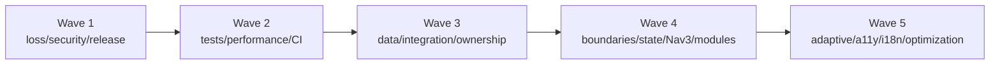

# MusFit Architecture Remediation Backlog — 2026-07-10

## Purpose and authority

This is the agent handoff for findings in the
[full app architecture audit](app-architecture-audit-2026-07-10.md), pinned to
commit `23e45544cef22c55d44959ad1abe5e808b565154`. Packages are ordered by
dependency, not by perceived novelty.

The package definitions and acceptance contracts below remain authoritative.
For work after 2026-07-16, the
[active remediation slice plan](architecture-remediation-slice-plan-2026-07-16.md)
supersedes this document's original one-package-per-agent/PR execution rule.
Package IDs remain independently traceable and must not be silently expanded
outside their acceptance contracts.

## Revalidation status

Revalidate every package against current `origin/master` before starting it. At
`7bb6218`, the first three Wave 1 packages are complete:

| Package | Current status |
| --- | --- |
| `W1-SEC-01` | Completed by PR #79 (`266cf1f`; merge `d31d187`) |
| `W1-DATA-01` | Completed by PR #80 (`976727a`; merge `92ef43a`) |
| `W1-DATA-02` | Completed by PR #81 (`7f97e7f`; merge `7bb6218`) |

Their original scope and acceptance criteria remain below as implementation
history and as regression invariants; do not open duplicate remediation work.

## Common handoff contract

Every package must:

1. start from current `origin/master` on a scoped branch;
2. read the finding and current source before changing code;
3. add/adjust a focused failing test first where behavior changes;
4. run the focused tests named in its row;
5. run:

   ```powershell
   . .\scripts\android\android-env.ps1
   .\scripts\dev\verify-musfit.ps1 -Preset Full
   ```

6. run `git diff --check` and retain privacy-safe evidence;
7. install/reset `MusFit_API36` using
   `scripts/android/install-seed-musfit.ps1 -Reset` unless the package is
   explicitly non-device or destructive-account/Health work;
8. execute its listed device scenario and measurable performance condition;
9. push a draft PR that names finding IDs, commands, device evidence, migration
   risk, compatibility decision, and rollback path.

Performance packages use the release-like Macrobenchmark target once
`W2-PERF-01` exists. Before then, they must record the same manual command and
device on both sides. A default “no regression” gate means median and P90 stay
within 10%; UI-only neutral refactors use 5% where stated.

## Concurrency and overlap keys

Packages with the same exclusive key serialize. Different keys may run in
parallel after their dependencies are merged.

| Key | Shared files/authority |
| --- | --- |
| `build-root` | root/app Gradle, version catalog, settings, signing/variants |
| `ci` | `.github/workflows`, release scripts, workflow contracts |
| `db-schema` | Room entities, database version, migrations, exported schemas |
| `app-nav` | `AppNavGraph`, destination contracts, root scaffold |
| `food-data` / `food-ui` | Food repository/DAO or Food screens/ViewModel |
| `training-data` / `training-ui` | Training repository/DAO or Training screens/ViewModel |
| `health` | Health gateway/manager/repository/permissions |
| `profile-ui` / `today-ui` | corresponding feature UI/ViewModels |
| `shared-ui` | theme, common components, strings, chart contracts |

## Dependency waves



## Wave 1 — Data-loss, component-security, and distributable-release blockers

### W1-SEC-01 — Remove the exported seed/data-wipe surface

- **Status:** Completed in PR #79 (`266cf1f`; merge `d31d187`).
- **Findings/size/key:** SEC-001; M; debug source set, `ci` only for manifest assertion.
- **Scope:** replace the exported receiver with an instrumentation or non-distributed internal seed interface; keep emulator reset/seed usable.
- **Dependencies/concurrency:** none; may run with DATA packages; coordinate variant name with W1-REL-01.
- **Acceptance/tests:** separate-package invocation denied; production/Obtainium merged manifest has no component/action; seed helper contract and manifest/instrumentation tests pass.
- **Device/performance:** API 36 unauthorized probe then approved reset/seed; no ANR and completion within helper timeout.

### W1-DATA-01 — Replace unsafe Food parent `REPLACE` writers

- **Status:** Completed in PR #80 (`976727a`; merge `92ef43a`).
- **Findings/size/key:** DATA-001 (Food); M; `food-data`.
- **Scope:** true upsert/update for foods, meals, templates, recipes, and other parent rows; retain only proven intentional child replacements.
- **Dependencies/concurrency:** none; parallel with W1-DATA-02; precedes all ownership migrations.
- **Acceptance/tests:** favorite/edit preserves servings, diary/barcode/template/recipe relations and rolls back atomically; focused `LocalFoodRepositoryTest` plus DAO/FK tests.
- **Device/performance:** edit/favorite a referenced seeded food and relaunch; scalar update remains O(1).

### W1-DATA-02 — Replace unsafe Training/AI parent `REPLACE` writers

- **Status:** Completed in PR #81 (`7f97e7f`; merge `7bb6218`).
- **Findings/size/key:** DATA-001 (Training/AI); M; `training-data` plus AI DAO files.
- **Scope:** update-preserving writes for exercises, routines, sessions, folders, chat threads/settings; document safe child replacements.
- **Dependencies/concurrency:** none; parallel with W1-DATA-01, but serialize any shared DAO module file.
- **Acceptance/tests:** parent metadata edits preserve routine/session sets and messages; focused Training/AI repository and relationship tests.
- **Device/performance:** edit seeded routine/session/thread metadata and relaunch; scalar updates O(1).

### W1-HC-01 — Add Food write permissions and complete rationale

- **Findings/size/key:** HC-001, HC-006; S; `health` plus main manifest.
- **Scope:** declare `WRITE_NUTRITION`/`WRITE_HYDRATION`; make rationale inventory match every read/write permission.
- **Dependencies/concurrency:** none; parallel with data/security packages; serialize manifest with W1-REL-01.
- **Acceptance/tests:** merged-manifest and rationale inventory tests; Health manager/Food sync tests pass.
- **Device/performance:** API 36 grant and one disposable test meal/water export; correctness only.

### W1-SEC-02 — Separate internal LAN HTTP from production TLS

- **Findings/size/key:** SEC-002; M; `build-root`, network policy, Hermes URL tests.
- **Scope:** internal-only LAN permission and loopback/RFC1918 cleartext; production omits LAN permission and rejects all HTTP.
- **Dependencies/concurrency:** W1-REL-01 variant naming; serialize with W1-SEC-03 if both touch config module.
- **Acceptance/tests:** variant manifests and IPv4/IPv6 URL-policy tests; public HTTP rejected, HTTPS works everywhere.
- **Device/performance:** internal LAN and production HTTPS smoke; request setup neutral.

### W1-SEC-03 — Remove compiled Hermes secrets

- **Findings/size/key:** SEC-003; S; build config + AI config/repository.
- **Scope:** delete API-key BuildConfig path/default; runtime Keystore entry remains the only credential source.
- **Dependencies/concurrency:** independent; coordinate `app/build.gradle.kts` with build-root owner.
- **Acceptance/tests:** generated/APK string scans contain no supplied key; fresh install has no implicit key; Keystore lifecycle tests pass.
- **Device/performance:** enter/use/remove a temporary key on disposable emulator; zero startup network work.

### W1-REL-01 — Create internal and production-shaped variants

- **Findings/size/key:** REL-001; M; `build-root`.
- **Scope:** `internal` owns developer defaults, seeding, LAN, debug application ID; production APK/AAB are non-debuggable and secret-free. Do not introduce private keys in repo.
- **Dependencies/concurrency:** design with W1-SEC-01/02/03; serialize all build-root packages.
- **Acceptance/tests:** variant merged-manifest/source-set contract tests and debug/release builds; `com.musfit.internal` cannot overwrite production.
- **Device/performance:** side-by-side clean installs on API 28/37; production-shaped startup within manual baseline.

### W1-REL-02 — Define the production-key/install migration

- **Findings/size/key:** REL-002; M; account export/import plus release docs, `db-schema` only if a durable handoff record is required.
- **Scope:** choose and implement one approved path: secure export/import, one-time bridge, or explicit reset; document key custody and rollback.
- **Dependencies/concurrency:** W1-REL-01; DATA-002 design consulted but not implemented here.
- **Acceptance/tests:** existing debug-signed install reaches production safely or presents approved reset; no plaintext secrets; upgrade matrix automated where possible.
- **Device/performance:** use a copy/disposable install only; migration retains counts/checksums within documented time/size budgets.

### W1-REL-03 — Enable R8/resource shrinking safely

- **Findings/size/key:** REL-003; M; `build-root` plus keep rules.
- **Scope:** full-mode R8/resource shrinking for production-shaped builds; retain mapping/usage/seeds; start from library consumer rules and narrow app rules.
- **Dependencies/concurrency:** W1-REL-01; serialize build-root; W2-PERF-01 later replaces manual budgets.
- **Acceptance/tests:** minified Room/Hilt/Moshi/auth/Health/scanner critical flows and release lint pass; mapping/usage retained.
- **Device/performance:** API 28/37 seeded smoke; size decreases and manual startup/frame P90 does not regress >10%.

### W1-REL-04 — Sign and publish verified APK/AAB artifacts

- **Findings/size/key:** REL-001; M; `ci` and signing secret configuration.
- **Scope:** CI builds signed optimized Obtainium APK and Play-ready AAB once, then promotes those exact artifacts with SHA-256 checksums.
- **Dependencies/concurrency:** W1-REL-01/02/03 and W1-SEC-01/02/03; exclusive release workflow.
- **Acceptance/tests:** APK/AAB verification succeeds; manifests are hardened; publication jobs depend on verification and expose commit/checksum.
- **Device/performance:** clean API 28/37 installs plus approved existing-install path; metrics within W1-REL-03 gate.

## Wave 2 — Device tests, performance harnesses, migration safety, and CI guardrails

### W2-TEST-01 — Add real SQLite migration/DAO instrumentation

- **Findings/size/key:** TEST-001, DATA-003; M; test infrastructure + `db-schema` fixtures.
- **Scope:** `MigrationTestHelper`, every supported origin→latest, recent adjacent hops, sentinel relationships, FK checks, representative DAO transactions.
- **Dependencies/concurrency:** W1-DATA-01/02; precedes ownership schema; serialize schema fixtures.
- **Acceptance/tests:** managed API 28/37 migration suite validates identity/schema/data and fails a deliberately broken fixture.
- **Device/performance:** representative large DB migration budget recorded; never destructive fallback.

### W2-TEST-02 — Add Compose semantics and a small E2E layer

- **Findings/size/key:** TEST-002; L split as `W2-TEST-02A` local fake-backed Compose tests and `W2-TEST-02B` managed-device E2E; `shared-ui` test fixtures.
- **Scope:** Food logging, Training set/rest, Profile/settings, back/scanner/restoration, denial/offline; avoid duplicating unit coverage.
- **Dependencies/concurrency:** 02A before 02B; can parallel with database/performance harnesses.
- **Acceptance/tests:** critical journeys run in CI; failures publish UI tree/log/screenshot; high-level tests remain a small layer.
- **Device/performance:** API 28/37 lane with documented runtime/flakiness budget.

### W2-TEST-03 — Add screenshot/adaptive/accessibility regression matrix

- **Findings/size/key:** TEST-003; M; screenshot plugin, goldens, `shared-ui`.
- **Scope:** 400/610/900 dp widths, representative heights, light/dark, LTR/RTL, 1.5× font for top-level and critical Food/Training/Profile/scanner states.
- **Dependencies/concurrency:** W2-TEST-02A fixture foundation; exclusive golden baseline review.
- **Acceptance/tests:** deterministic CI diffs; references never auto-update; semantics/touch-bound checks included.
- **Device/performance:** screenshot lane separate from benchmarks and bounded in duration.

### W2-PERF-01 — Add Macrobenchmark and Baseline Profile modules

- **Findings/size/key:** PERF-001; M; `build-root` new modules but isolated source.
- **Scope:** production-shaped profileable target; cold/warm startup; Food, Training, Profile journeys; generated app-owned profile; benchmark JSON retention.
- **Dependencies/concurrency:** W1-REL-01/03; serialize root Gradle, otherwise parallel with tests.
- **Acceptance/tests:** profile contains `com/musfit`; repeatable median/P90/min/max; CI flags >10% approved-baseline regression.
- **Device/performance:** managed API 28/37, with non-gating Pixel confirmation when connected.

### W2-BUILD-01 — Repair and enforce the workflow contract

- **Findings/size/key:** BUILD-004, supports ARCH-003; S; dev scripts + `ci`.
- **Scope:** derive schema/routes/tool paths from source; execute contract before CI publication.
- **Dependencies/concurrency:** none; parallel except workflow file overlap.
- **Acceptance/tests:** current source passes; mismatch fixture fails; no stale hardcoded schema prose.
- **Device/performance:** none; warm verification time neutral.

### W2-BUILD-02 — Make configuration cache clean and enabled

- **Findings/size/key:** BUILD-003; S; `build-root` versioning.
- **Scope:** replace direct Git process with cache-safe provider/CI property; enable configuration/build caching and diagnostics.
- **Dependencies/concurrency:** coordinate monotonic versioning with W1-REL packages; serialize build-root.
- **Acceptance/tests:** two full gates show zero problems and cache reuse; version code tests fail closed.
- **Device/performance:** no device; second configuration phase improves/neutral.

### W2-BUILD-03 — Remove unused WorkManager/Hilt Work

- **Findings/size/key:** PERF-003; S; app dependencies/manifest.
- **Scope:** delete unused runtime/testing/compiler dependencies and initializer; no substitute worker.
- **Dependencies/concurrency:** W1-REL packages merged; precedes W2-BUILD-04.
- **Acceptance/tests:** no initializer/classes/tasks; full suite equivalent.
- **Device/performance:** release startup/size improves or is neutral.

### W2-BUILD-04 — Migrate Room/Hilt annotation processing to KSP

- **Findings/size/key:** BUILD-002; M; `build-root`, generated schemas/DI.
- **Scope:** remove legacy kapt tasks; preserve AGP built-in Kotlin and schema identity.
- **Dependencies/concurrency:** W2-BUILD-03; serialize build-root.
- **Acceptance/tests:** no kapt task; Room schema 35 byte/identity equivalent; Hilt bindings and full gate pass.
- **Device/performance:** seeded DI/database smoke; clean/incremental compile improves or is neutral.

### W2-CI-01 — Add release/device/screenshot/performance CI lanes

- **Findings/size/key:** TEST-005; M; `ci`.
- **Scope:** PR debug+release; main/nightly managed migration/UI/screenshots; performance profile lane; release promotion consumes verified artifacts.
- **Dependencies/concurrency:** W2-TEST-01/02/03, W2-PERF-01, W2-BUILD-01; exclusive CI orchestration.
- **Acceptance/tests:** actionable reports for every lane; publication cannot bypass or rebuild another commit.
- **Device/performance:** API 28/37 matrices; PR/nightly time budgets documented.

### W2-SUPPLY-01 — Add dependency verification, immutable actions, SBOM/provenance

- **Findings/size/key:** REL-004; M; `build-root` verification metadata + `ci`.
- **Scope:** action SHA pins, Gradle/wrapper verification, SBOM/checksums, commit-bound provenance.
- **Dependencies/concurrency:** W1-REL-04; serialize CI/build metadata.
- **Acceptance/tests:** tampered fixture/dependency/action is rejected; signed metadata published.
- **Device/performance:** none; no runtime payload change.

### W2-DEPS-01 — Establish stable-first dependency governance

- **Findings/size/key:** BUILD-005; M; version catalog and update automation.
- **Scope:** preview exception register with owner/expiry, scoped automated updates, unused dependency review.
- **Dependencies/concurrency:** W2-SUPPLY-01; individual upgrades remain separate PRs.
- **Acceptance/tests:** no preview without rationale; update PRs run full debug/release lanes.
- **Device/performance:** integration smoke; dependency-only change ≤5% startup/size regression.

### W2-QUALITY-01 — Ratchet lint and add static formatting/analysis

- **Findings/size/key:** BUILD-006; M; lint/static config + `ci`.
- **Scope:** resolve security/correctness warnings, baseline only dated owned debt, fail new warnings; add formatting/static checks.
- **Dependencies/concurrency:** Wave-1 security fixes; parallel with coverage.
- **Acceptance/tests:** zero security/correctness lint; remaining baseline owned/expiring; release lint in CI.
- **Device/performance:** relevant smoke only; no runtime dependencies.

### W2-COVERAGE-01 — Add actionable aggregate coverage

- **Findings/size/key:** TEST-004; S; test/build reporting.
- **Scope:** aggregate unit/instrumented reports excluding generated/render boilerplate; changed-code and critical-package gates.
- **Dependencies/concurrency:** W2-TEST-01/02; parallel with quality work.
- **Acceptance/tests:** changed business logic ≥80%, critical domain/repositories ≥90%, overall non-decreasing.
- **Device/performance:** CI report-time budget only.

### W2-TEST-04 — Replace source-text behavior assertions

- **Findings/size/key:** TEST-006; M; tests only, split by `A build/manifest`, `B Food`, `C Training/Profile` if needed.
- **Scope:** retain deliberate architecture contracts; replace UI/behavior string scans with compiler/manifest/semantic/runtime tests.
- **Dependencies/concurrency:** relevant W2 harness available; split packages use separate feature test files.
- **Acceptance/tests:** no new source-text behavior test; every removed high-risk check has executable replacement.
- **Device/performance:** replacement lane stays within its declared runtime budget.

## Wave 3 — Data/integration correctness and account ownership

### W3-OWN-01 — Add Food account ownership

- **Findings/size/key:** DATA-002 (Food); L; `db-schema` + `food-data`.
- **Scope:** account-scope diary, custom foods/servings/favorites, goals, recipes/templates, planning/shopping/water/sync state; keep immutable reference catalog explicitly shared; migrate legacy rows to `local-default`.
- **Dependencies/concurrency:** W1-DATA-01 and W2-TEST-01; serial first ownership migration.
- **Acceptance/tests:** two-account Food isolation and migration sentinel tests; every DAO query/write requires owner or explicit shared-catalog contract.
- **Device/performance:** switch two seeded accounts; query plans use account-leading indexes and P90 does not regress.

### W3-OWN-02 — Add Training account ownership

- **Findings/size/key:** DATA-002 (Training); L; `db-schema` + `training-data`.
- **Scope:** routines, overlays/custom exercises, sessions/sets, settings/history under active account; retain shared starter catalog only where documented.
- **Dependencies/concurrency:** W3-OWN-01 merged; serial schema version/export.
- **Acceptance/tests:** two-account isolation and legacy migration; active workout cannot cross account.
- **Device/performance:** switch accounts around active/completed workouts; indexed query P90 neutral.

### W3-OWN-03 — Own Health, Today/coach, and dashboard data

- **Findings/size/key:** DATA-002 remainder; M; `db-schema`, health/today data.
- **Scope:** body metrics/summaries/sync state, coach messages, pins and user overlays; no cross-account export selection.
- **Dependencies/concurrency:** W3-OWN-02; serial schema.
- **Acceptance/tests:** complete top-level two-account matrix and export-source assertions.
- **Device/performance:** account switches show no stale cross-user cards; query P90 neutral.

### W3-HC-01 — Introduce stable, versioned Health record identity

- **Findings/size/key:** HC-002; M; `health`.
- **Scope:** account+entity/session client IDs, record versions, persisted provider identity, collision-proof custom meal representation.
- **Dependencies/concurrency:** W3-OWN-01/02/03; exclusive Health identity contract.
- **Acceptance/tests:** retry leaves one record, edit updates, accounts/labels never collide; mapper/repository fake tests.
- **Device/performance:** opt-in disposable Health sandbox; calls O(changed records).

### W3-HC-02 — Model partial/failure/cancellation explicitly

- **Findings/size/key:** HC-003; M; `health`.
- **Scope:** typed result, cancellation rethrow, empty/deleted/unavailable distinctions, transactional local sync-state update.
- **Dependencies/concurrency:** may precede W3-HC-01 if types avoid identity files; otherwise serialize.
- **Acceptance/tests:** partial/total failure, cancellation, revocation, and legitimate empty tests; no stale success.
- **Device/performance:** deny/revoke on disposable emulator; cancellation completes within one second.

### W3-HC-03 — Add deletion and reconciliation

- **Findings/size/key:** HC-004; L split as `W3-HC-03A` MusFit-authored export deletion and `W3-HC-03B` imported-record reconciliation; `health`.
- **Scope:** explicit source-of-truth rules, delete by stable ID, stale/permission-loss handling; never erase manual local entries implicitly.
- **Dependencies/concurrency:** W3-HC-01/02 and ownership complete; 03A before 03B.
- **Acceptance/tests:** local deletion removes authored records; provider deletion/revocation marks/clears cache correctly; retry idempotent.
- **Device/performance:** disposable Health records only; reconciliation proportional to changed IDs.

### W3-HC-04 — Page and batch Health reads

- **Findings/size/key:** HC-005; M; `health`.
- **Scope:** consume all page tokens; range/batched aggregation while retaining zone-aware local days.
- **Dependencies/concurrency:** W3-HC-02; may run after identity work in separate gateway files.
- **Acceptance/tests:** fake two-page data complete; seven-day call count O(metric count); totals unchanged.
- **Device/performance:** record call count/latency materially improves on dense fake data.

### W3-DATA-01 — Batch Food relations and add evidence-backed indexes

- **Findings/size/key:** DATA-004 (Food/body/meal); M; `food-data` + `db-schema`.
- **Scope:** one relation/projection for foods+servings; account-aware indexes/collations for saved-food search, meals, body metrics.
- **Dependencies/concurrency:** W3-OWN-01 and W2-PERF-01; schema overlap serial with ownership.
- **Acceptance/tests:** O(1) query-count for 500 foods; representative plans use intended indexes; outputs/write semantics unchanged.
- **Device/performance:** 1,000-food seeded search/frame and DB-call P90 improves; index write/storage budget recorded.

### W3-DATA-02 — Batch Training history and optimize latest/search queries

- **Findings/size/key:** DATA-004 (Training); M; `training-data` + `db-schema`.
- **Scope:** batch prior sets/PRs by exercise IDs; account-aware exercise search/latest completed workout indexes/query shape.
- **Dependencies/concurrency:** W3-OWN-02; can parallel Food work only if schema version ownership is coordinated—default serialize.
- **Acceptance/tests:** O(1) history query-count for 20 exercises; query plans avoid correlated/temp work where justified.
- **Device/performance:** large active-workout benchmark reduces DB calls/frame P90 without write regression.

### W3-NET-01 — Make Hermes/auth cancellation propagate

- **Findings/size/key:** DATA-005; S; network/AI/auth.
- **Scope:** cancellable Retrofit/OkHttp bridge and explicit `CancellationException` rethrow before fallback/error mapping.
- **Dependencies/concurrency:** independent; coordinate SEC files only.
- **Acceptance/tests:** delayed fake proves underlying call canceled <1 s and no assistant failure/provider link is committed.
- **Device/performance:** cancel internal delayed request; no leaked call/thread, normal latency neutral.

### W3-DATA-03 — Add account and all-data erasure

- **Findings/size/key:** DATA-006; M; account repository/settings UI + all owned data.
- **Scope:** confirmed delete-account/delete-all transaction, fallback account, Keystore cleanup, retention copy, optional authored Health cleanup.
- **Dependencies/concurrency:** all W3 ownership and W3-HC-03A; exclusive destructive-data contract.
- **Acceptance/tests:** delete A removes only A and secrets; fallback valid; canceled confirmation changes nothing.
- **Device/performance:** disposable two-account emulator only; large deletion atomic and within documented time.

### W3-CAMERA-01 — Make scanner acquisition lifecycle-safe

- **Findings/size/key:** UI-005; M; scanner files.
- **Scope:** shared session owner, cancellable/guarded provider acquisition, owned-use-case unbind, retained backpressure/close behavior.
- **Dependencies/concurrency:** W2-TEST-02/03; before scanner module move; parallel with data/Health.
- **Acceptance/tests:** delayed provider, rapid open/back/rotate, denial/permanent denial, executor/scanner cleanup.
- **Device/performance:** API 28/37 20-cycle camera loop; no retained client/thread or memory/frame regression.

### W3-RESTORE-01 — Restore app shell and Profile drafts

- **Findings/size/key:** NAV-002 (shell/Profile); M; `app-nav` + `profile-ui`.
- **Scope:** restoration policy, top destination/subroute, settings/editor bounded drafts; no repository snapshots.
- **Dependencies/concurrency:** W2-TEST-02/03; serialize root nav, but parallel with Food/Training restoration after policy lands.
- **Acceptance/tests:** rotate/process-kill on every Profile editor/settings route; no duplicate save.
- **Device/performance:** root-kill managed test; restore-to-frame ≤10% regression.

### W3-RESTORE-02 — Restore Food routes and drafts

- **Findings/size/key:** NAV-002 (Food); M; `food-ui`.
- **Scope:** selected date, add mode/query, entity IDs, bounded food/recipe/template drafts, scanner return; not large lists/results.
- **Dependencies/concurrency:** W3-RESTORE-01 policy; parallel with Training if AppNavGraph ownership is avoided.
- **Acceptance/tests:** reproduce the audited process kill and retain route/query; every Food editor round-trip; no duplicate write.
- **Device/performance:** API 28/37 process recreation; saved payload bounded and restore neutral.

### W3-RESTORE-03 — Restore Training routes/drafts without backgrounding rest timers

- **Findings/size/key:** NAV-002 (Training); M; `training-ui`.
- **Scope:** routine/editor/page IDs and bounded set input; active workout remains Room-owned; rest timer stops when screen closes.
- **Dependencies/concurrency:** W3-RESTORE-01 policy; parallel Food work.
- **Acceptance/tests:** rotation/process kill in routine/active workout, no duplicate set; close screen stops timer.
- **Device/performance:** API 28/37 process suite; no background service/wakelock and restore neutral.

### W3-BOUNDARY-01 — Remove transport/UI/Room boundary leaks

- **Findings/size/key:** ARCH-002; L split as `W3-BOUNDARY-01A` Food remote mapping, `01B` Profile display-label boundary, `01C` neutral Health snapshots/ports.
- **Scope:** no UI remote DTO, no Profile→Food UI import, no integration→Room entity or data→concrete adapter edge.
- **Dependencies/concurrency:** relevant ownership/Health result types; A/B can parallel, C serial with Health work.
- **Acceptance/tests:** compile-time architecture tests for all forbidden edges; behavior mappings fully covered.
- **Device/performance:** behavior-neutral seeded smoke; compile/package/runtime ≤5% regression.

### W3-DOC-01 — Repair and automate architecture documentation drift

- **Findings/size/key:** ARCH-003; M; docs + workflow contract.
- **Scope:** current schema/routes/components, stable generated fact block, remove or automate volatile counts; preserve rationale.
- **Dependencies/concurrency:** W2-BUILD-01; run after Wave-3 schema/route decisions to avoid immediate churn.
- **Acceptance/tests:** source-derived drift command passes and deliberate mismatch fails; README/handoffs agree.
- **Device/performance:** documentation-only; full gate, no runtime condition.

## Wave 4 — Module boundaries, repository/state decomposition, and Navigation 3

### W4-STATE-F1 — Extract Food pure presentation calculations/reducers

- **Findings/size/key:** UI-001; M; `food-ui` plus pure domain tests.
- **Scope:** move derived summaries/filters/favorites/ratings/form reductions out of ViewModel without changing state contract yet.
- **Dependencies/concurrency:** W3-BOUNDARY-01A and W2 harnesses; parallel with Training state work.
- **Acceptance/tests:** existing Food suite plus focused pure reducer tests; ViewModel behavior byte-for-output equivalent where practical.
- **Device/performance:** Food journeys unchanged; main-thread calculation/recomposition no worse than 5%.

### W4-STATE-F2 — Split Food route state into independently collected slices

- **Findings/size/key:** UI-001; L split as `W4-STATE-F2A` diary/trackers, `F2B` Add/database, `F2C` editors/planning; each one PR under `food-ui`.
- **Scope:** route coordinator composes narrow state/use cases; ViewModels split only where destination lifetime is real; remove broad rescans.
- **Dependencies/concurrency:** W4-STATE-F1, restoration complete; A/B/C serialize where `FoodViewModel` overlaps.
- **Acceptance/tests:** feature tests remain green; unrelated slice update does not invalidate/collect other domains; fakes narrow.
- **Device/performance:** Compose metrics and Food macrobenchmarks improve/neutral; traced recompose materially below audited 506 ms CPU on equivalent flow.

### W4-STATE-T1 — Split Training coordinator/state by real destinations

- **Findings/size/key:** UI-001; L split `T1A` routines/library and `T1B` active workout/history; `training-ui`.
- **Scope:** pure reducers/use cases and destination-lifetime state; preserve Room-owned active workout and screen-scoped rest timer.
- **Dependencies/concurrency:** restoration complete; parallel with Food packages; T1A/T1B serialize shared ViewModel.
- **Acceptance/tests:** all Training tests/back/rest behavior; narrow state updates and fakes.
- **Device/performance:** active workout/list benchmarks improve/neutral and no timer background work.

### W4-NAV-01 — Introduce stable Navigation 3 root with parity

- **Findings/size/key:** NAV-001; M; `app-nav`.
- **Scope:** serializable `NavKey`s, `rememberNavBackStack`, `NavDisplay`, typed root results; preserve visit-order tabs and current compact chrome; no adaptive scenes yet.
- **Dependencies/concurrency:** W3-RESTORE-01/02/03, W2 UI tests, W3-BOUNDARY packages; exclusive app-nav.
- **Acceptance/tests:** Today/Food/Training/Profile visit-order back, process restoration, predictive-back preview/cancel/commit.
- **Device/performance:** API 28/37; no duplicate VM/collector and nav/startup P90 ≤5% regression.

### W4-NAV-F1 — Move Food/scanner routes to typed Navigation 3 entries

- **Findings/size/key:** NAV-001; M; `food-ui` + scanner entry contracts.
- **Scope:** Food subflows, barcode/label results, typed result consumption; no transport DTO in key.
- **Dependencies/concurrency:** W4-NAV-01, W3-CAMERA-01, Food restoration/boundary; parallel with Training entry package if AppNavGraph untouched.
- **Acceptance/tests:** every Food route/scanner round-trip, back, process death, no duplicate scan handling.
- **Device/performance:** seeded scanners/Add flow; ≤5% navigation/frame regression.

### W4-NAV-F2 — Move Training routes/page stack to Navigation 3 entries

- **Findings/size/key:** NAV-001; M; `training-ui`.
- **Scope:** routines, exercise/history/progress, active workout keys; replace route-like ViewModel page stack.
- **Dependencies/concurrency:** W4-NAV-01 and Training restoration/state boundary; parallel Food entry package.
- **Acceptance/tests:** all Training back/results/process cases; rest timer still stops on screen close.
- **Device/performance:** seeded workout; no duplicate collectors and ≤5% regression.

### W4-NAV-F3 — Move Profile/Today routes and cross-feature actions

- **Findings/size/key:** NAV-001; M; `profile-ui`, `today-ui`, app action contracts.
- **Scope:** typed Profile/settings/progress keys and Today shortcuts that request actions without importing feature implementations.
- **Dependencies/concurrency:** W4-NAV-01 and boundary cleanup; serialize root entry registry only.
- **Acceptance/tests:** all settings/progress/shortcut/back/process cases.
- **Device/performance:** Profile/Today benchmark ≤5% regression.

### W4-MOD-01 — Add convention build logic and architecture checks

- **Findings/size/key:** ARCH-001; M; `build-root`/build-logic.
- **Scope:** Android library/Compose/Kotlin/test conventions, dependency rules, module graph report; do not change feature code.
- **Dependencies/concurrency:** W2-BUILD-02/04; before third new production module; exclusive root Gradle.
- **Acceptance/tests:** sample/new modules use conventions; forbidden graph fixture fails; full gate passes.
- **Device/performance:** no behavior; configuration/clean build neutral.

### W4-MOD-C1/C2/C3 — Extract shared model, design system, and testing modules

- **Findings/size/key:** ARCH-001, ARCH-002; three sequential M PRs: `C1 :core:model`, `C2 :core:designsystem`, `C3 :core:testing`; `build-root` plus shared code.
- **Scope:** C1 pure models/domain/neutral ports; C2 tokens/components; C3 fakes/fixtures. Minimal APIs; C1 remains Android-free.
- **Dependencies/concurrency:** W4-MOD-01 and W3-BOUNDARY; serialize root Gradle, but source moves are distinct.
- **Acceptance/tests:** dependency tests, domain/component/fixture suites; no feature implementation edge.
- **Device/performance:** behavior-neutral goldens; leaf model/component edit rebuild graph narrows; APK neutral.

### W4-MOD-D1/D2/D3 — Extract database, network, and data modules

- **Findings/size/key:** ARCH-001, ARCH-002; three sequential L/M PRs: `D1 :core:database`, `D2 :core:network`, `D3 :core:data`; `db-schema`, network, repository/DI.
- **Scope:** Room/migrations; Retrofit/Moshi/OkHttp; repository implementations depending inward. No schema/wire behavior change during moves.
- **Dependencies/concurrency:** core modules, ownership/Health/data packages complete; fixed D1→D2→D3 order.
- **Acceptance/tests:** schema identity unchanged, all repository/provider/auth tests, architecture graph acyclic.
- **Device/performance:** seeded offline/online/auth-config smoke; query/mapping benchmark ≤5% regression and incremental graph improves.

### W4-MOD-I1/I2 — Isolate Health Connect and scanner integrations

- **Findings/size/key:** ARCH-001, ARCH-002; two M PRs: `I1 :integration:healthconnect`, `I2 :integration:scanner`.
- **Scope:** Android adapters depend on neutral models/ports, never Room; scanner exposes typed results, never Food UI state.
- **Dependencies/concurrency:** core data/network plus W3 Health/camera and W4-NAV-F1; I1/I2 serialize root Gradle but source ownership differs.
- **Acceptance/tests:** integration mapper/gateway/lifecycle tests and identical permission/scanner behavior.
- **Device/performance:** Health non-destructive status and scanner cycles; size ownership attributed, ≤5% latency/memory regression.

### W4-MOD-F1/F2/F3/F4 — Extract coarse top-level feature modules

- **Findings/size/key:** ARCH-001; four separate M/L PRs in order: `F1 :feature:food`, `F2 :feature:training`, `F3 :feature:profile`, `F4 :feature:today`.
- **Scope:** move each feature's presentation/ViewModels/entry provider/tests; export only entry/action contracts; never another feature implementation.
- **Dependencies/concurrency:** all core/integration/Nav3 packages; serialize because each touches app composition/settings. No per-screen modules.
- **Acceptance/tests:** feature suite, entry-provider/architecture tests, cross-feature shortcuts after every move.
- **Device/performance:** corresponding seeded journey; behavior/performance neutral and unrelated feature edits no longer rebuild implementation.

## Wave 5 — Adaptive UI, accessibility, localization readiness, and measured optimization

### W5-INSETS-01 — Complete edge-to-edge and IME behavior

- **Findings/size/key:** UI-006; M; activities/manifest/root/form scaffolds, `app-nav` + `shared-ui`.
- **Scope:** `enableEdgeToEdge`, theme-aware bars, nav contrast, `adjustResize`, exactly-once safe/IME inset consumption.
- **Dependencies/concurrency:** W2-TEST-03 and feature modules; serialize root adaptive work.
- **Acceptance/tests:** API 28/35/37, nav modes, themes, orientation, last field/action in every editor; no doubled padding.
- **Device/performance:** dark status icons legible; IME and launch/frame P90 ≤5% regression.

### W5-LIFE-F1/F2/F3/F4 — Lifecycle-aware collection per feature

- **Findings/size/key:** UI-002; four separate M/S PRs for Food, Training, Profile, Today; feature UI keys.
- **Scope:** `collectAsStateWithLifecycle`, safe `WhileSubscribed(5_000)`, mutations/sync remain independent.
- **Dependencies/concurrency:** state/module moves complete; four features may run in parallel, serialize within feature.
- **Acceptance/tests:** STOPPED unsubscribes, resume current, repeated tabs no duplicate collectors/missed values.
- **Device/performance:** background query/collector work drops or remains zero; foreground P90 ≤5% regression.

### W5-IMAGE-01 — Use one image loader and static list thumbnails

- **Findings/size/key:** UI-004; M; `training-ui` + DI.
- **Scope:** application-scoped Coil loader, static list/picker thumbnails, detail-only GIF animation.
- **Dependencies/concurrency:** Training module and benchmark; parallel with non-Training work.
- **Acceptance/tests:** one loader/process; request policy/cache/error/GIF detail tests.
- **Device/performance:** 100-item browse lowers/equalizes PSS/frame P90 and improves cache hits.

### W5-LAZY-F1/F2 — Lazily render unbounded Food collections

- **Findings/size/key:** UI-003; two M PRs: `F1` Add/saved database, `F2` recipes/templates/ingredient catalog; `food-ui`.
- **Scope:** keyed lazy lists/grids and search/paging thresholds; bounded forms stay ordinary; no unbounded nested scroll.
- **Dependencies/concurrency:** Food state/module, W5-INSETS-01; default serialize unless files are disjoint.
- **Acceptance/tests:** 1,000 foods/500 recipes remain responsive and selection/scroll survives filter/return.
- **Device/performance:** Food benchmark frame P90, peak composition, and PSS improve.

### W5-A11Y-01 — Fix root navigation/segmented semantics and target sizes

- **Findings/size/key:** A11Y-001; M; `app-nav` + `shared-ui`.
- **Scope:** ≥48 dp bounds, one merged label, role/selected state for nav and segments; preserve visuals.
- **Dependencies/concurrency:** screenshot harness and Nav3 root; serialize adaptive root.
- **Acceptance/tests:** semantics/bounds plus TalkBack/Switch Access for root controls.
- **Device/performance:** 1.5× font; no nav recomposition/frame regression.

### W5-A11Y-F1/F2/F3 — Fix feature control accessibility

- **Findings/size/key:** A11Y-001; three separate M PRs: Food, Training, Profile+Today; corresponding feature UI.
- **Scope:** undersized icons/custom rows, roles, labels, merged descendants; preserve visual density.
- **Dependencies/concurrency:** W5-INSETS-01 and feature modules; different features parallel, serialize with that feature's lazy/i18n work.
- **Acceptance/tests:** bounds/semantics and TalkBack/Switch traversal for touched journeys.
- **Device/performance:** no frame P90 regression.

### W5-A11Y-CHART-01 — Add accessible chart actions/data views

- **Findings/size/key:** A11Y-002; M; shared/Training charts.
- **Scope:** summary/selected semantics, next/previous actions, equivalent semantic list/table; preserve Canvas pointer behavior.
- **Dependencies/concurrency:** screenshot/semantics harness and design module; parallel with non-chart work.
- **Acceptance/tests:** every point/date discoverable/selectable without touch and announced once.
- **Device/performance:** bounded semantics nodes; chart draw/frame P90 ≤5% regression.

### W5-ADAPT-01 — Adopt stable adaptive root navigation

- **Findings/size/key:** UI-007; M; `app-nav`.
- **Scope:** stable `NavigationSuiteScaffold`: bottom/rail/wide chrome by window class; preserve coach action/history; hide chrome on camera.
- **Dependencies/concurrency:** W5-INSETS-01, W5-A11Y-01, stable Nav3, screenshot matrix; exclusive root.
- **Acceptance/tests:** compact/medium/expanded/orientation/mouse/keyboard goldens and interactions; compact unchanged.
- **Device/performance:** width change does not recreate navigation/collectors; tab P90 ≤5% regression.

### W5-ADAPT-F1/F2 — Add source-justified stable list-detail scenes

- **Findings/size/key:** UI-007, NAV-001; two M PRs: `F1` Training routine/exercise/history, `F2` Food database/recipe; feature UI.
- **Scope:** stable Material Navigation 3 scenes and stable lazy adaptive grids; active workout/forms remain full-screen where appropriate.
- **Dependencies/concurrency:** W5-ADAPT-01, feature Nav3/lazy work; Food and Training may parallel.
- **Acceptance/tests:** compact single-pane parity; expanded selection/back/panes; no duplicate VM/collector.
- **Device/performance:** expanded scroll/selection P90 ≤5%, no eager full dataset.

### W5-I18N-01 — Introduce resource-backed typed UI text

- **Findings/size/key:** A11Y-003; M; `shared-ui`/resources.
- **Scope:** strings/plurals and context-free message keys/args; current-locale display formatting; `Locale.ROOT` only for machine normalization.
- **Dependencies/concurrency:** design/model/feature modules and screenshot matrix; base before feature migrations.
- **Acceptance/tests:** `en-XA`, `ar-XB`, `de-DE`; ViewModels context-free; typed plural/argument tests.
- **Device/performance:** pseudo-locale/1.5× matrix; formatting/recomposition neutral.

### W5-I18N-F1/F2/F3/F4 — Migrate feature copy, formatting, and RTL

- **Findings/size/key:** A11Y-003; four separate M PRs: Food, Training, Profile, Today+app/scanners.
- **Scope:** literals/plurals/resources, locale dates/numbers, auto-mirrored direction; route/database/wire keys remain stable/nonlocalized.
- **Dependencies/concurrency:** W5-I18N-01 and feature adaptive/a11y work; features parallel, serialize within feature.
- **Acceptance/tests:** pseudo-locale/RTL/German formatting with no clipping/wrong direction; English equivalent.
- **Device/performance:** frame P90 ≤5%; formatting cached appropriately.

### W5-SIZE-01 — Remove extended-icon code ownership

- **Findings/size/key:** PERF-002; M; icons/dependency/design system.
- **Scope:** maintained vector/subset for 66 used icons after R8 baseline; remove material-icons-extended.
- **Dependencies/concurrency:** W1-REL-03, design module, W2-PERF-01; serialize shared UI icon changes.
- **Acceptance/tests:** every icon state/golden present; dependency absent; size report attributes reduction.
- **Device/performance:** APK/AAB shrink and startup/frame neutral.

### W5-SIZE-02 — Publish ABI-specific Obtainium APKs

- **Findings/size/key:** REL-003, PERF-002; M; `build-root`/`ci`.
- **Scope:** arm64 (and explicitly supported alternatives) from verified build; Play remains split AAB; retain bundled ML models.
- **Dependencies/concurrency:** W1 release/R8 and W2 provenance/benchmark; exclusive release workflow.
- **Acceptance/tests:** correct ABI install matrix/checksums; unsupported device gets clear artifact choice; scanner smoke.
- **Device/performance:** arm64 APK ≤60 MiB and AAB ≤40 MiB or approved measured exception; no regression.

### W5-PERF-01 — Optimize only measured recomposition/query hot spots

- **Findings/size/key:** UI-001, DATA-004 follow-through; M per hot spot, one PR each.
- **Scope:** use post-refactor Compose metrics/Perfetto/Macrobenchmark to select one root cause; no speculative `@Stable` or broad cache layer.
- **Dependencies/concurrency:** state/lazy/data and benchmark work complete; package names exact screen/hot spot and owns only it.
- **Acceptance/tests:** before/after trace chain identifies CPU/query reduction with behavior tests.
- **Device/performance:** ≥10% improvement in selected median/P90 metric and no other critical-journey regression.

### W5-PLAT-01 — Maintain experimental adaptive API watchlist

- **Findings/size/key:** PLAT-001; S docs-only.
- **Scope:** MediaQuery/non-lazy Grid/FlexBox status and adoption gates; no production dependency/API.
- **Dependencies/concurrency:** stable adaptive rollout complete; fully parallel docs.
- **Acceptance/tests:** any proposal proves stable release, unmet scenario, min-SDK, tests/benchmarks, ADR rollback.
- **Device/performance:** none until proposal; then measurable benefit is mandatory.

## Merge-order and parallelization summary

1. Wave 1 data/security packages can run in parallel by key; all `build-root`/release packages serialize in the listed dependency order.
2. In Wave 2, database, UI, screenshot, and performance harnesses can run concurrently. CI orchestration waits for them. Root Gradle packages serialize.
3. Ownership migrations are sequential because each changes the Room schema. Health result modeling can begin in parallel, but stable IDs/deletion wait for ownership. Food and Training query work follows their ownership migration.
4. Restoration packages may parallelize by feature after the shell policy. Boundary A/B may parallelize; Health boundary C serializes with Health work.
5. State work may parallelize Food versus Training. Navigation root serializes before feature entries. Module moves then follow the fixed conventions → core → adapters/data → integrations → features order.
6. Wave 5 parallelizes across features, never within the same feature/file key. Root insets/navigation/accessibility/adaptive packages serialize. Feature adaptive work follows root adaptive; feature localization follows its adaptive/accessibility changes to avoid repeated golden churn.

## Finding-to-package coverage

| Findings | Primary packages |
| --- | --- |
| REL-001, REL-002, REL-003, SEC-001, SEC-002, SEC-003 | W1-SEC-01, W1-SEC-02/03, W1-REL-01/02/03/04, W5-SIZE-02 |
| DATA-001 | W1-DATA-01/02 |
| HC-001, HC-006 | W1-HC-01 |
| TEST-001, DATA-003 | W2-TEST-01 |
| TEST-002, TEST-003, PERF-001 | W2-TEST-02/03, W2-PERF-01 |
| BUILD-002/003/004/005/006, PERF-003 | W2-BUILD-01/02/03/04, W2-DEPS-01, W2-QUALITY-01 |
| TEST-004/005/006, REL-004 | W2-COVERAGE-01, W2-CI-01, W2-TEST-04, W2-SUPPLY-01 |
| DATA-002 | W3-OWN-01/02/03 |
| HC-002/003/004/005 | W3-HC-01/02/03A/03B/04 |
| DATA-004/005/006 | W3-DATA-01/02/03, W3-NET-01, W5-PERF-01 |
| UI-005, NAV-002, ARCH-002/003 | W3-CAMERA-01, W3-RESTORE-01/02/03, W3-BOUNDARY-01A/B/C, W3-DOC-01 |
| UI-001, NAV-001 | W4-STATE-F1/F2A/F2B/F2C/T1A/T1B, W4-NAV-01/F1/F2/F3 |
| ARCH-001 | W4-MOD-01/C1/C2/C3/D1/D2/D3/I1/I2/F1/F2/F3/F4 |
| UI-006, UI-002, UI-003, UI-004 | W5-INSETS-01, W5-LIFE-F1/F2/F3/F4, W5-LAZY-F1/F2, W5-IMAGE-01 |
| A11Y-001/002, UI-007 | W5-A11Y-01/F1/F2/F3/CHART-01, W5-ADAPT-01/F1/F2 |
| A11Y-003 | W5-I18N-01/F1/F2/F3/F4 |
| PERF-002 | W5-SIZE-01/02 |
| PLAT-001 | W5-PLAT-01 |

## Definition of complete for the program

The architecture program is complete only when production APK/AAB artifacts
are signed, optimized, traceable, and gated; every supported migration is
validated on framework SQLite; accounts are isolated across all personal data;
Health sync is idempotent, deletion-aware, paged, and failure-explicit; module
edges are acyclic/enforced; critical navigation/drafts survive process death;
stable adaptive/accessibility/localization contracts are covered; and approved
release benchmarks show no unresolved P0/P1 regression.
