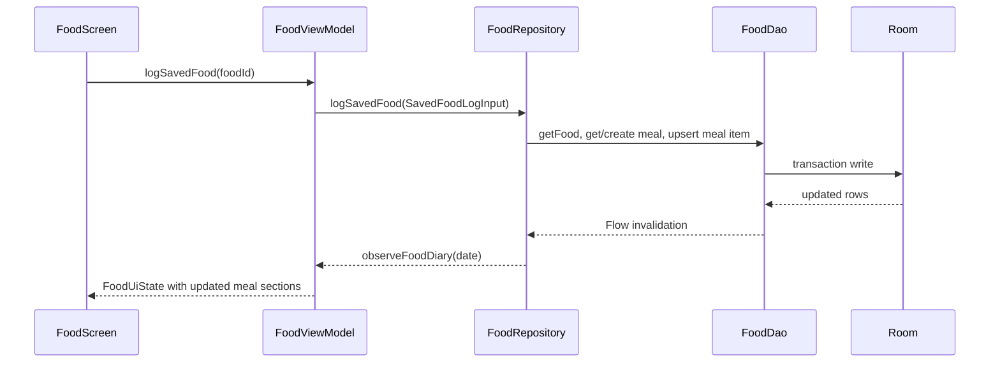
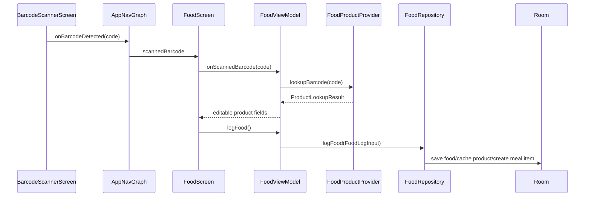
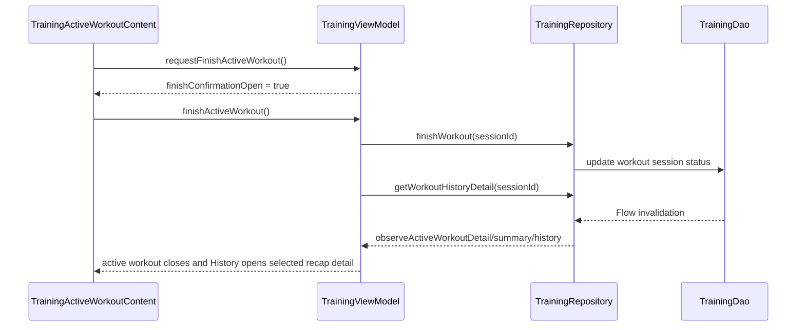

# MusFit Data Models

This document describes the model layers used by MusFit and where each type should be owned.

## Model Ownership

| Layer | Model type | Owner | Rule |
| --- | --- | --- | --- |
| Room | `*Entity` and DAO projection rows | `data/local` | Persisted schema and SQL read shapes. These are storage details. |
| Repository | Input/output data classes beside repository interfaces | `data/repository` | Public feature data contracts consumed by ViewModels. |
| UI | `*UiState` and UI-only enums | `ui/<feature>` | Screen state and presentation-specific derived values. |
| Domain | Pure models and calculators | `domain` | Android-free business calculations and parser outputs. |
| Remote | API DTOs and provider results | `data/remote` | External network payloads and provider abstraction results. |
| Integration | Health Connect payloads/results | `integrations/healthconnect` | Boundary models for Android Health Connect. |

The preferred conversion direction is:

```text
Room entity/projection -> repository model -> UI state
Remote DTO -> provider result -> repository model -> UI state
Domain input -> domain result -> repository/UI derived model
```

## Room Database

Source: `app/src/main/java/com/musfit/data/local/MusFitDatabase.kt`

Database:

- Class: `MusFitDatabase`
- File: `data/local/MusFitDatabase.kt`
- Name: `musfit.db`
- Version: 31
- Exported schemas: `app/schemas/com.musfit.data.local.MusFitDatabase/`
- DAOs: `AccountDao`, `FoodDao`, `TrainingDao`, `HealthDao`, `ProfileDao`, `UserGoalsDao`

### Account Tables

Source: `app/src/main/java/com/musfit/data/local/entity/AccountEntities.kt`

| Entity | Table | Purpose | Key fields |
| --- | --- | --- | --- |
| `AccountEntity` | `accounts` | Local account identity for user-owned data and optional provider sign-in. | `id`, `displayName`, optional `email`, optional provider-scoped `remoteUserId`, `authProvider`, optional `avatarUrl`, timestamps. |
| `AccountSessionEntity` | `account_session` | Device-local active account pointer. | `key = "active"`, `activeAccountId`, `updatedAtEpochMillis`. |

The first account id is `local-default`. Profile, app settings, and Today goals use the active account id as their singleton row id. Food, Training, and Health ownership are separate follow-up slices. Google and GitHub sign-in only link identity metadata to the active local account; access tokens and cloud sync state are not stored.

### Food Tables

Source: `app/src/main/java/com/musfit/data/local/entity/FoodEntities.kt`

| Entity | Table | Purpose | Key fields |
| --- | --- | --- | --- |
| `FoodEntity` | `foods` | Saved foods and imported products. | `id`, `name`, `brand`, serving grams, per-100 g macros, detailed nutrients, barcode, category, favorite, image URL. |
| `FoodServingEntity` | `food_servings` | Custom serving options for a saved food. | `id`, `foodId`, `label`, `grams`. |
| `MealEntity` | `meals` | A dated meal bucket. | `id`, `dateEpochDay`, `type`, timestamps. |
| `MealDefinitionEntity` | `meal_definitions` | User-visible meal names, optional times, and ordering. | `id`, `name`, `timeMinutes`, `sortOrder`. |
| `MealItemEntity` | `meal_items` | Food entries inside meals. | `id`, `mealId`, `foodId`, `quantityGrams`, `status`. |
| `BarcodeProductEntity` | `barcode_products` | Cached Open Food Facts barcode metadata. | barcode, provider name, raw JSON, quality, linked food id. |
| `FoodGoalEntity` | `food_goals` | Nutrition and water goals. | calories, macros, fiber, sugar, saturated fat, sodium, mode, training calories, net carbs, water goal. |
| `QuickCaloriePresetEntity` | `quick_calorie_presets` | Favorite quick-log presets. | name, calories, macros, favorite. |
| `MealTemplateEntity` | `meal_templates` | Saved meal templates. | name, meal type, favorite, timestamps. |
| `MealTemplateItemEntity` | `meal_template_items` | Foods inside meal templates. | template id, food id, quantity grams, sort order. |
| `RecipeEntity` | `recipes` | Recipe metadata. | name, category, serving name, serving grams, servings, cooked yield, favorite. |
| `RecipeIngredientEntity` | `recipe_ingredients` | Recipe ingredients. | recipe id, food id, quantity grams, unit label, unit grams, unit quantity, sort order. |
| `ShoppingListItemEntity` | `shopping_list_items` | Generated or manual shopping list rows. | name, category, quantity grams, checked/manual flags, source key. |
| `WaterEntryEntity` | `water_entries` | Dated hydration logs. | date, amount ml, created time. |
| `FoodHealthConnectSyncEntity` | `food_health_connect_sync` | Food/hydration sync settings and last result. | enabled flag, last sync, last failure. |

Food indexes:

- `foods`: barcode, name, brand, category, favorite.
- `food_servings`: food id.
- `meals`: date.
- `meal_items`: meal id, food id.
- `barcode_products`: unique barcode, linked food id.
- `meal_template_items`: template id, food id.
- `recipe_ingredients`: recipe id, food id.
- `shopping_list_items`: category, unique source key.
- `water_entries`: date.

### Training Tables

Source: `app/src/main/java/com/musfit/data/local/entity/TrainingEntities.kt`

| Entity | Table | Purpose | Key fields |
| --- | --- | --- | --- |
| `ExerciseEntity` | `exercises` | Exercise library and detail row. | name, category, equipment, target muscles, primary muscles, secondary muscles, instructions, local notes, custom flag. |
| `RoutineFolderEntity` | `routine_folders` | User-configurable routine folders. | name, sort order, created/updated time. |
| `RoutineEntity` | `routines` | Routine metadata and organization. | name, notes, created/updated time, starter flag, optional folder id, legacy program name, tags. |
| `RoutineExerciseEntity` | `routine_exercises` | Exercises inside routines. | routine id, exercise id, sort order, target sets, target reps, per-exercise rest seconds. |
| `RoutineExerciseSetEntity` | `routine_exercise_sets` | Saved set plan rows for routine exercises. | routine exercise id, sort order, set type, target reps, optional target weight. |
| `WorkoutSessionEntity` | `workout_sessions` | Workout session header. | routine id, title, status, start/end, notes, Health Connect export ids. |
| `WorkoutSetEntity` | `workout_sets` | Logged workout set. | session id, exercise id, sort order, set type, reps, weight, duration, distance, RPE, notes, completed, superset group id, planned rest seconds. |
| `TrainingSettingsEntity` | `training_settings` | Local Training tool preferences. | default rest seconds, bar weight, available plates CSV. |

Training indexes:

- `workout_sessions`: routine id, started time, status.
- `workout_sets`: session id, exercise id.
- `routines`: folder id.
- `routine_exercises`: routine id, exercise id.
- `routine_exercise_sets`: routine exercise id.

Current Training schema limitations:

- Routine organization now uses user-configurable folders. Legacy starter `programName` and CSV-backed tags remain for metadata/backward compatibility; there is not yet a separate multi-week program schedule table.
- Rest timer defaults, bar weight, and available plates are persisted as global Training tool settings. Saved routines can override rest seconds per exercise, and active routine workouts inherit that planned rest.

### Health Tables

Source: `app/src/main/java/com/musfit/data/local/entity/HealthEntities.kt`

| Entity | Table | Purpose | Key fields |
| --- | --- | --- | --- |
| `BodyMetricEntity` | `body_metrics` | Imported or local body metrics. | type, value, unit, measured time, source, external id. |
| `DailyHealthSummaryEntity` | `daily_health_summaries` | Dated Health Connect summary. | date, steps, active/total calories, distance, sleep minutes, exercise minutes/session count, latest weight, latest body fat, resting heart rate. |
| `HealthConnectSyncStateEntity` | `health_connect_sync_state` | Generic Health Connect sync state. | availability, granted permissions CSV, import/export timestamps, failure. |

### Profile And Goals Tables

Source:

- `app/src/main/java/com/musfit/data/local/entity/ProfileEntities.kt`
- `app/src/main/java/com/musfit/data/local/entity/UserGoalsEntity.kt`

| Entity | Table | Purpose | Key fields |
| --- | --- | --- | --- |
| `UserProfileEntity` | `user_profile` | Per-account profile and body-goal inputs. | `id` stores the account id, profile inputs, goal intent, updated time. |
| `AppSettingsEntity` | `app_settings` | Per-account app preferences. | `id` stores the account id, unit system, theme mode. |
| `UserGoalsEntity` | `user_goals` | Per-account cross-cutting Today goals not stored in `food_goals`. | `id` stores the account id, step goal, weekly session target, target weight. |

## DAO Projection Rows

DAO projection rows are read models returned by SQL joins or aggregates. They avoid leaking raw multi-table joins into repositories.

Food projection rows:

- `MealNutritionRow`
- `FoodDiaryEntryRow`
- `MealTemplateItemRow`
- `RecipeIngredientRow`

Training projection rows:

- `RoutineSummaryRow`
- `ActiveWorkoutSummaryRow`
- `RoutineExerciseDetailRow`
- `WorkoutSetDetailRow`
- `WorkoutHistorySummaryRow`
- `ExerciseProgressSetRow`

Repositories map these rows into public repository models.

## Food Repository Models

Source: `app/src/main/java/com/musfit/data/repository/FoodRepository.kt`

### Core Nutrition

| Model | Purpose | Important fields |
| --- | --- | --- |
| `FoodNutrition` | Basic macros per 100 g or calculated totals depending on context. | calories, protein, carbs, fat. |
| `NutritionTotals` | Aggregate calories and macros. | calories, protein, carbs, fat. |
| `NutritionDetails` | Advanced nutrients. | fiber, sugar, saturated fat, sodium, potassium, calcium, iron, vitamin D, vitamin C, magnesium. |

`FoodNutrition` and `NutritionTotals` live in `domain/model/NutritionModels.kt`; `NutritionDetails` lives beside `FoodRepository` because it maps directly to stored Food fields.

### Food Inputs

| Model | Purpose |
| --- | --- |
| `FoodLogInput` | Log a scanned/manual food, optionally with a provider lookup result and barcode. |
| `SavedFoodLogInput` | Log or plan an existing saved food by id, meal, quantity, and date. |
| `QuickCalorieLogInput` | Log calories and macros without a saved food. |
| `DiaryEntryUpdateInput` | Move or resize an existing diary entry. |
| `SavedFoodUpsertInput` | Create or update a saved food, including nutrition, barcode, favorite, servings, category, and image URL. |
| `FoodServingInput` | Create or update a custom serving option. |
| `QuickCaloriePresetInput` | Save a favorite quick log. |
| `MealTemplateItemInput` | Food and quantity inside a meal template. |
| `MealTemplateUpdateInput` | Rename/update a meal template and replace item rows. |
| `FoodMealDefinitionInput` | Create/update meal name, optional time, and sort order. |
| `RecipeIngredientInput` | Food, gram quantity, and selected unit inside a recipe. |
| `RecipeUpsertInput` | Create/update recipe metadata and ingredients. |
| `ManualShoppingListItemInput` | Add a manual shopping list item. |
| `WaterLogInput` | Add hydration for a date. |

### Food Outputs

| Model | Purpose |
| --- | --- |
| `SavedFoodItem` | Repository-level saved food record with nutrition, details, servings, barcode/category/favorite/source data. |
| `FoodServingOption` | Saved food serving choice. |
| `FoodDiaryEntry` | One diary row with calculated quantity-based nutrition. |
| `FoodDiaryMeal` | Meal group with entries, logged totals, planned totals, and detail totals. |
| `FoodDiary` | Whole-day diary totals and meal groups. |
| `FoodPlanDay` | One date in the seven-day plan strip. |
| `FoodWeeklyDaySummary` / `FoodWeeklySummary` | Seven-day diary, water, and goal summary for the weekly MusFit score. |
| `FoodProgressSummary` | Local date-range diary, water, and goal summary; currently used for 28-day progress stats. |
| `QuickCaloriePreset` | Favorite quick-log preset. |
| `FoodGoal` | Food nutrition and hydration goals. |
| `FoodWaterSummary` | Dated water consumed and water goal. |
| `FoodHealthConnectSyncState` | Food Health Connect availability, permission, enabled, and sync status. |
| `FoodHealthConnectSyncResult` | Counts for exported nutrition and hydration records. |
| `MealTemplate` and `MealTemplateItem` | Saved meal template and items. |
| `FoodMealDefinition` | User-visible custom/default meal metadata. |
| `Recipe` and `RecipeIngredient` | Recipe details with calculated per-serving nutrition. |
| `ShoppingListGroup` and `ShoppingListItem` | Grouped shopping list. |

### Food Enums

| Enum | Values |
| --- | --- |
| `FoodDiaryEntryStatus` | `Logged`, `Planned` |
| `FoodGoalMode` | `Balanced`, `HighProtein`, `KetoLowCarb`, `MuscleGain`, `WeightLoss`, `MediterraneanStyle`, `CleanEating`, `Custom` |

### Food Repository Interface

Key read APIs:

```kotlin
fun observeDailyNutrition(date: LocalDate): Flow<NutritionTotals>
fun observeFoodDiary(date: LocalDate): Flow<FoodDiary>
fun observeFoodPlan(startDate: LocalDate): Flow<List<FoodPlanDay>>
fun observeSavedFoods(): Flow<List<SavedFoodItem>>
fun observeRecentFoods(limit: Int = 20): Flow<List<SavedFoodItem>>
fun observeSameAsYesterday(mealType: String, date: LocalDate): Flow<List<SavedFoodItem>>
fun observeFoodGoal(): Flow<FoodGoal>
fun observeMealTemplates(): Flow<List<MealTemplate>>
fun observeCustomMealDefinitions(): Flow<List<FoodMealDefinition>>
fun observeShoppingList(): Flow<List<ShoppingListGroup>>
fun observeWaterSummary(date: LocalDate): Flow<FoodWaterSummary>
fun observeWeeklyFoodSummary(startDate: LocalDate): Flow<FoodWeeklySummary>
fun observeFoodProgressSummary(startDate: LocalDate, dayCount: Int): Flow<FoodProgressSummary>
fun observeFoodHealthConnectSyncState(): Flow<FoodHealthConnectSyncState>
fun observeRecipes(): Flow<List<Recipe>>
fun observeQuickCaloriePresets(): Flow<List<QuickCaloriePreset>>
```

Key write APIs:

```kotlin
suspend fun logFood(input: FoodLogInput): String
suspend fun logSavedFood(input: SavedFoodLogInput): String
suspend fun planSavedFood(input: SavedFoodLogInput): String
suspend fun quickLog(input: QuickCalorieLogInput): String
suspend fun updateDiaryEntry(input: DiaryEntryUpdateInput)
suspend fun deleteDiaryEntry(mealItemId: String)
suspend fun upsertSavedFood(input: SavedFoodUpsertInput): String
suspend fun deleteSavedFood(foodId: String)
suspend fun toggleFavoriteFood(foodId: String, isFavorite: Boolean)
suspend fun mergeDuplicateFoods(primaryFoodId: String, duplicateFoodIds: List<String>)
suspend fun updateFoodGoal(goal: FoodGoal)
suspend fun upsertCustomMealDefinition(input: FoodMealDefinitionInput): String
suspend fun saveMealAsTemplate(date: LocalDate, mealType: String, name: String): String
suspend fun logMealTemplate(templateId: String, mealType: String, date: LocalDate): List<String>
suspend fun copyMeal(fromDate: LocalDate, toDate: LocalDate, mealType: String, status: FoodDiaryEntryStatus): List<String>
suspend fun copyDay(fromDate: LocalDate, toDate: LocalDate, status: FoodDiaryEntryStatus): List<String>
suspend fun generateShoppingList(startDate: LocalDate, endDate: LocalDate): List<ShoppingListGroup>
suspend fun logWater(input: WaterLogInput): String
suspend fun syncFoodToHealthConnect(date: LocalDate): FoodHealthConnectSyncResult
suspend fun upsertRecipe(input: RecipeUpsertInput): String
suspend fun logRecipe(recipeId: String, mealType: String, servings: Double, date: LocalDate): String
suspend fun seedStarterFoods()
```

## Training Repository Models

Source: `app/src/main/java/com/musfit/data/repository/TrainingRepository.kt`

| Model | Purpose |
| --- | --- |
| `LoggedWorkoutSet` | Quick logger row and summary input. |
| `TrainingSummary` | Daily completed sets, total volume, and best estimated one-rep max. |
| `TrainingProgressAnalytics` | Derived all-training progress analytics for muscle-group volume and weekly volume. |
| `MuscleGroupProgress` | Completed set count and volume for one target muscle. |
| `WeeklyTrainingVolume` | Completed workout count, set count, and volume for one calendar week. |
| `WorkoutForExport` | Latest completed session plus sets for Health Connect export. |
| `ExerciseSummary` | Exercise library row exposed to UI, including primary/secondary muscles for local search/filtering. |
| `ExerciseDetail` | Exercise detail/drill-down row with equipment, category, primary/secondary muscles, instructions, and local notes. |
| `ExerciseInput` | New custom exercise input. |
| `RoutineFolder` | User-configurable routine folder row. |
| `RoutineSummary` | Routine list row with folder, legacy program name, tags, and muscle groups. |
| `RoutineSetInput` | Saved routine set plan row with set type, target reps, and optional target weight. |
| `RoutineExerciseDetail` | One exercise inside a routine detail, including per-exercise rest and set plans. |
| `RoutineDetail` | Full routine detail for editing, including folder metadata. |
| `RoutineInput` | Routine create/update input, including optional folder assignment and legacy program metadata. |
| `RoutineExerciseInput` | Exercise target inside routine input, including rest seconds and set plans. |
| `ActiveWorkoutSummary` | Resume banner data. |
| `WorkoutSetInputData` | Active workout set edit input. |
| `LoggedWorkoutSetDetail` | Active/history set row. |
| `TrainingSettings` / `TrainingSettingsInput` | Local rest timer and plate-tool settings exposed as repository models. |
| `WorkoutExerciseBlock` | Exercise plus sets, target reps, prior best estimated 1RM, and optional superset label in active/history detail. |
| `SupersetGroup` | Grouped exercise blocks sharing one active workout superset id. |
| `ExerciseGrouping` | Active workout render grouping: `Single` for standalone exercises or `Superset` for grouped exercise blocks. |
| `ActiveWorkoutDetail` | Full active workout state, including session notes. |
| `WorkoutHistorySummary` | Completed workout list row. |
| `WorkoutRecapSummary` | Completed workout recap: duration, exercises, completed sets, volume, PR count, and session notes. |
| `WorkoutHistoryDetail` | Completed workout detail, including flat exercise blocks, derived superset groupings for history display, and a recap summary. |

Key read APIs:

```kotlin
fun observeExercises(query: String = "", muscle: String? = null, equipment: String? = null): Flow<List<ExerciseSummary>>
suspend fun getExerciseDetail(exerciseId: String): ExerciseDetail?
fun observeRoutineSummaries(): Flow<List<RoutineSummary>>
fun observeRoutineFolders(): Flow<List<RoutineFolder>>
fun observeActiveWorkoutSummary(): Flow<ActiveWorkoutSummary?>
fun observeActiveWorkoutDetail(): Flow<ActiveWorkoutDetail?>
fun observeTrainingSettings(): Flow<TrainingSettings>
fun observeWorkoutHistory(): Flow<List<WorkoutHistorySummary>>
fun observeExerciseProgress(exerciseId: String): Flow<ExerciseProgress?>
fun observeTrainingProgressAnalytics(): Flow<TrainingProgressAnalytics>
suspend fun getWorkoutHistoryDetail(sessionId: String): WorkoutHistoryDetail?
fun observeDailyTrainingSummary(date: LocalDate): Flow<TrainingSummary>
```

Key write APIs:

```kotlin
suspend fun createCustomExercise(input: ExerciseInput): String
suspend fun updateExerciseLocalNotes(exerciseId: String, notes: String?)
suspend fun createRoutine(input: RoutineInput): String
suspend fun updateRoutine(routineId: String, input: RoutineInput)
suspend fun duplicateRoutine(routineId: String): String
suspend fun deleteRoutine(routineId: String)
suspend fun createRoutineFolder(name: String): String
suspend fun updateRoutineFolder(folderId: String, name: String)
suspend fun deleteRoutineFolder(folderId: String)
suspend fun startBlankWorkout(): String
suspend fun startWorkoutFromRoutine(routineId: String): String
suspend fun addExerciseToActiveWorkout(sessionId: String, exerciseId: String)
suspend fun addSetToExercise(sessionId: String, exerciseId: String, input: WorkoutSetInputData): String
suspend fun duplicateLastSet(sessionId: String, exerciseId: String): String?
suspend fun updateWorkoutSet(setId: String, input: WorkoutSetInputData)
suspend fun deleteWorkoutSet(setId: String)
suspend fun updateActiveWorkoutNotes(sessionId: String, notes: String?)
suspend fun moveWorkoutSet(setId: String, direction: Int)
suspend fun updateTrainingSettings(input: TrainingSettingsInput)
suspend fun createSuperset(sessionId: String, exerciseAId: String, exerciseBId: String): String?
suspend fun dissolveSuperset(sessionId: String, groupId: String)
suspend fun finishWorkout(sessionId: String)
suspend fun discardWorkout(sessionId: String)
suspend fun getLatestWorkoutForExport(): WorkoutForExport?
suspend fun seedStarterTrainingData()
suspend fun markWorkoutExported(sessionId: String, recordId: String, exportedAtEpochMillis: Long)
```

## Health Repository Models

Source: `app/src/main/java/com/musfit/data/repository/HealthRepository.kt`

Health uses domain and Room models directly for small boundary surfaces:

| Model | Source | Purpose |
| --- | --- | --- |
| `HealthConnectStatus` | `domain/health` | Availability and granted permission set. |
| `ImportedDailyHealthSummary` | `domain/health` | Imported steps, calories, distance, sleep, exercise, latest body metrics, and resting heart rate. |
| `ImportedBodyMetric` | `domain/health` | Imported body metric sample from Health Connect. |
| `DailyHealthSummaryEntity` | `data/local/entity` | Persisted daily summary. |
| `BodyMetricEntity` | `data/local/entity` | Weight and other body metric series. |

Key APIs:

```kotlin
suspend fun status(): HealthConnectStatus
suspend fun requestablePermissions(): Set<String>
fun observeDailySummary(date: LocalDate): Flow<DailyHealthSummaryEntity?>
suspend fun importDailySummary(date: LocalDate): ImportedDailyHealthSummary
suspend fun refreshRecentData(endDate: LocalDate, days: Int = 7): HealthConnectRefreshResult
suspend fun exportLatestWorkout(): String?
fun observeDailySummaries(startDate: LocalDate, endDate: LocalDate): Flow<List<DailyHealthSummaryEntity>>
fun observeWeightSeries(fromEpochMillis: Long): Flow<List<BodyMetricEntity>>
```

## Goals Repository Models

Source: `app/src/main/java/com/musfit/data/repository/GoalsRepository.kt`

`UserGoals` stores cross-cutting goals for the Today dashboard:

| Field | Purpose |
| --- | --- |
| `stepGoal` | Daily step target. |
| `weeklySessionTarget` | Weekly workout session target. |
| `targetWeightKg` | Optional target body weight. |

API:

```kotlin
fun observeUserGoals(): Flow<UserGoals>
suspend fun updateUserGoals(goals: UserGoals)
```

## UI State Models

UI state models are documented screen-by-screen in [screen-contracts.md](screen-contracts.md). The largest state object is `FoodUiState`, which currently owns many editor and modal fields. Smaller state objects include:

- `TodayUiState`
- `TrainingUiState`
- `ProfileSettingsUiState`

UI state models may contain:

- Display labels.
- Text-field input strings.
- Derived progress fractions.
- Visibility and selection flags.
- Presentation-only grouped lists.

They should not be used as Room entities or remote DTOs.

## Remote Food Models

Source: `app/src/main/java/com/musfit/data/remote/food`

### Provider Contract

```kotlin
interface FoodProductProvider {
    suspend fun lookupBarcode(barcode: String): ProductLookupResult
    suspend fun searchProducts(query: String, pageSize: Int = 20): ProductSearchResult
}
```

`ProductLookupResult`:

| Result | Meaning |
| --- | --- |
| `Found` | Product exists. Carries barcode, name, brand, serving grams, nutrition, detail nutrition, category, image URL, quality, and raw JSON. |
| `NotFound` | Provider returned no product for barcode. |
| `Failed` | Lookup failed with a message. |

`ProductDataQuality`:

- `Complete`
- `Incomplete`

`ProductSearchResult`:

- `Success(query, products)`
- `Failed(query, message)`

### Open Food Facts DTOs

| DTO | Purpose |
| --- | --- |
| `OpenFoodFactsResponse` | Barcode API response wrapper. |
| `OpenFoodFactsProduct` | Product name, brand, serving quantity, categories, image URL, nutriments. |
| `OpenFoodFactsNutriments` | Per-100 g macro and micronutrient fields from Open Food Facts JSON. |
| `OpenFoodFactsSearchResponse` | Search API response wrapper. |
| `OpenFoodFactsSearchHit` | Search result product hit. |

The provider maps DTOs into `ProductLookupResult.Found` before data reaches repositories or ViewModels.

## Domain Models And Calculators

### Nutrition

Source:

- `app/src/main/java/com/musfit/domain/model/NutritionModels.kt`
- `app/src/main/java/com/musfit/domain/nutrition/NutritionCalculator.kt`

Models:

- `FoodNutrition(caloriesKcal, proteinGrams, carbsGrams, fatGrams)`
- `MealItemInput(foodId, quantityGrams, nutritionPer100g)`
- `NutritionTotals(caloriesKcal, proteinGrams, carbsGrams, fatGrams)`

Calculator:

- `NutritionCalculator.calculateMealTotals(items)`

### Training

Source:

- `app/src/main/java/com/musfit/domain/model/TrainingModels.kt`
- `app/src/main/java/com/musfit/domain/training/WorkoutCalculator.kt`
- `app/src/main/java/com/musfit/domain/training/PlateCalculator.kt`
- `app/src/main/java/com/musfit/domain/training/WarmupSetCalculator.kt`
- `app/src/main/java/com/musfit/domain/training/TrendChartScaler.kt`

Models:

- `WorkoutSetInput`
- `PersonalRecords`
- `ExerciseProgressSetInput`
- `TrainingTrendPoint`
- `ExerciseProgressHistoryEntry`
- `ExerciseBestSetSummary`
- `ExercisePrTimelineEntry`
- `ExerciseProgress`
- `ChartPoint`
- `ChartGeometry`

Calculator:

- `WorkoutCalculator.totalVolume(sets)`
- `WorkoutCalculator.estimatedOneRepMax(weightKg, reps)`
- `WorkoutCalculator.personalRecords(sets)`
- `WorkoutCalculator.exerciseProgress(...)`
- `PlateCalculator.platesPerSide(totalWeightKg, barWeightKg, availablePlatesKg)`
- `WarmupSetCalculator.suggestions(workingWeightKg, workingReps, barWeightKg)`
- `TrendChartScaler.computeChartGeometry(values, widthPx, heightPx, paddingLeftPx, paddingRightPx, paddingTopPx, paddingBottomPx, tickCount)`
- `TrendChartScaler.nearestIndex(touchX, pointXs)`

### Food OCR

Source: `app/src/main/java/com/musfit/domain/food/NutritionLabelParser.kt`

Models:

- `ParsedNutritionLabel(caloriesKcal, proteinGrams, carbsGrams, fatGrams, fiberGrams, sugarGrams, saturatedFatGrams, sodiumMilligrams)`
- Derived parser metadata: `hasAnyValue`, `parsedFieldCount`, `confidenceLabel`

Parser:

- `NutritionLabelParser.parse(rawText)`

The parser is best-effort and intentionally returns nullable values. UI must present parsed values and parser confidence for user review before saving.

### Today

Source: `app/src/main/java/com/musfit/domain/today/WeeklyGoalsCalculator.kt`

Models:

- `WeeklyGoals`

Calculator:

- `WeeklyGoalsCalculator.compute(...)`
- `WeeklyGoalsCalculator.weightTrend(...)`

### Coach

Source: `app/src/main/java/com/musfit/domain/coach/CoachEngine.kt`

Models:

- `CoachCategory`
- `CoachAction`
- `CoachCue`
- `TimeOfDay`
- `CoachInput`
- `CoachBriefing`

Engine:

- `CoachEngine.briefing(input)`

The coach is deterministic and on-device. It does not call an AI or cloud service.

### Health

Source: `app/src/main/java/com/musfit/domain/health/HealthConnectStatus.kt`

Models:

- `HealthConnectStatus`
- `HealthConnectAvailability`
- `ImportedDailyHealthSummary`
- `ImportedBodyMetric`

## Health Connect Integration Models

Source: `app/src/main/java/com/musfit/integrations/healthconnect`

| Model | Purpose |
| --- | --- |
| `HealthConnectFoodExportPayload` | Dated food/hydration export input. |
| `HealthConnectFoodMealExport` | One meal's nutrition payload. |
| `HealthConnectFoodExportResult` | Nutrition and hydration record counts after export. |
| `ImportedDailyHealthSummary` | Read model for steps, calories, distance, sleep, exercise, weight, body fat, and resting heart rate. |

Gateway:

```kotlin
interface HealthConnectGateway {
    suspend fun status(): HealthConnectStatus
    suspend fun requestablePermissions(): Set<String>
    suspend fun foodRequestablePermissions(): Set<String>
    suspend fun readDailySummary(date: LocalDate): ImportedDailyHealthSummary
    suspend fun exportWorkout(session: WorkoutSessionEntity, sets: List<WorkoutSetEntity>): String?
    suspend fun exportFood(payload: HealthConnectFoodExportPayload): HealthConnectFoodExportResult?
}
```

## Data Flow Examples

### Log Saved Food



### Barcode Lookup And Log



### Finish Workout



## Schema Change Checklist

For any Room entity or table change:

1. Update the entity.
2. Bump `MusFitDatabase` version.
3. Add and register a matching `MIGRATION_x_y` in `DatabaseModule`.
4. Run Room schema export through the normal Gradle test/build flow.
5. Commit the new schema JSON under `app/schemas/com.musfit.data.local.MusFitDatabase/`.
6. Add or update repository/DAO tests that prove the migration and query behavior.

Do not add `fallbackToDestructiveMigration`.
